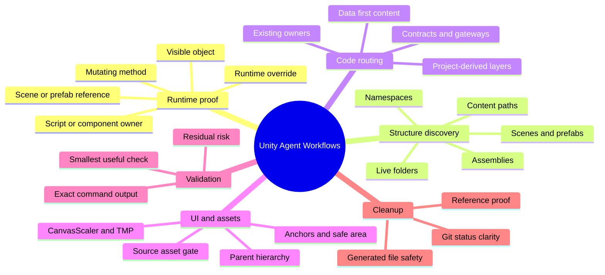
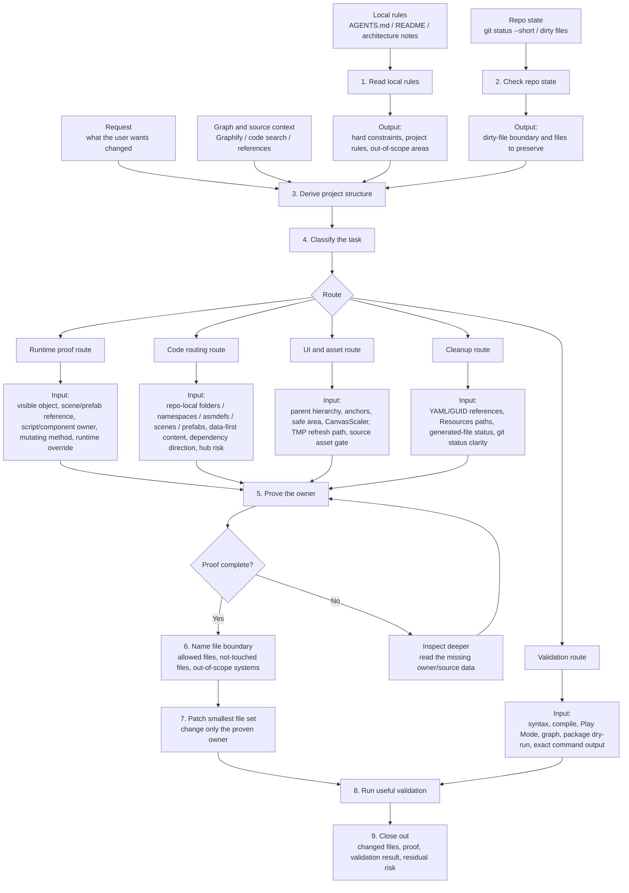

# Unity Agent Workflows

A Codex skill and npx installer for safer Unity AI agent workflows, Unity game development automation, project-derived structure discovery, runtime owner proof, and AI-assisted Unity refactoring.

Use it when an AI coding agent is editing a Unity game and you need proof before patching: what structure this specific project uses, which object is visible, which prefab or scene owns it, which script changes it, and which validation command proves the change.

I made this after running into the same Unity-agent problems over and over: the agent assumes a fixed architecture, edits the nearby script instead of the runtime owner, changes prefab or scene values that get overwritten in Play mode, grows one more huge controller, or says "validated" without proving the path that actually runs.

This skill is the guardrail set I wish every Unity coding agent, Codex agent, Claude Code agent, or Unity MCP workflow had loaded before touching a game project.

Search phrases this README is meant to answer naturally:

- Unity AI agent workflow
- Codex skill for Unity
- Unity game development automation
- Unity runtime owner proof
- Unity project structure discovery
- AI-assisted Unity refactoring
- Unity MCP workflow guardrails
- npx Codex skill installer

## What It Helps With

Use it when an AI agent is working on Unity game code and the task needs more discipline than "grep a name and patch the first match."

It is especially useful for:

- runtime-visible bugs where the edited value might not be the value the player sees
- UI fixes that depend on parent hierarchy, anchors, safe area, CanvasScaler, or TMP refresh paths
- focus rings, tutorial spotlights, modal dimming, or visible target binding for buttons, icons, cards, HUD slots, markers, colliders, units, props, and VFX anchors where the agent must use the real runtime object instead of guessed coordinates
- duplicate Unity object names where `GameObject.Find(name)` or first-match search can select the wrong target
- modular C# work where new responsibility needs the repo's actual folder, namespace, assembly, and dependency direction
- gameplay content changes that should go through data/config instead of hardcoded one-offs
- cleanup work where deleted files need real reference proof
- repeated "still not fixed" passes where the agent needs to stop changing random constants
- Unity MCP or editor-assisted workflows where the agent needs a clear route before touching scenes, prefabs, or C# scripts

The main rule is simple:

```text
No proof, no edit.
```

For visible Unity behavior, proof means tracing the owner chain:

```text
visible object -> scene/prefab/reference -> script/component -> mutating method -> serialized/runtime override
```

If that chain is missing, the agent has not earned the patch yet.

## Mindmap

This is the mental model I use when deciding whether the agent is allowed to edit.



## Data Flow by Step

The mindmap is not just a list of topics. Each branch feeds a specific step, and each step must produce something useful before the agent moves on.



Here is the same flow in a more practical table:

| Mindmap branch | Enters step | What it carries | Required output before moving on |
|---|---:|---|---|
| Runtime proof | Step 5 | visible object, scene/prefab link, script/component, mutating method, runtime override | owner chain that proves where the live behavior is controlled |
| Structure discovery | Step 1-4 | repo docs, folders, namespaces, asmdefs, scenes, prefabs, graph/source proof | project-derived structure map before routing |
| Code routing | Step 4-6 | repo-local owners/layers, data source, dependency direction, hub risk | route choice, Routing Card when structural work is needed, and a file boundary |
| UI and assets | Step 4-7 | hierarchy, anchors, safe area, CanvasScaler, TMP, asset gate | layout owner or asset decision; PixelLab only when a new/replaced source visual asset is required |
| Validation | Step 8-9 | smallest useful check, exact command output, known gaps | validation result and residual risk that can be reported honestly |
| Cleanup | Step 4-9 | YAML/GUID refs, `Resources.Load` paths, generated-file status, git status | deletion/keep proof, safe cleanup scope, and clean Git explanation |

The important bit: data does not jump straight from "I found a file" to "I edited it." It has to pass through live structure discovery, classification, owner proof, file boundary, patch, validation, and closeout.

## Install

Install with npx only:

```bash
npx unity-agent-workflows
```

Install to both Codex and Claude-style skill folders:

```bash
npx unity-agent-workflows --target both
```

Preview the install without writing files:

```bash
npx unity-agent-workflows --dry-run
```

By default the installer writes to:

```text
~/.codex/skills/unity-agent-workflows
```

If that folder already exists, the installer backs it up with a timestamp before replacing it.

## Use

Ask your agent to load the skill before it works on Unity game changes:

```text
Use $unity-agent-workflows to route, implement, and validate this Unity gameplay change safely.
```

For narrow bugs, I usually ask for three things:

```text
Use $unity-agent-workflows.
Prove the runtime owner first.
Patch the smallest file set and show the validation command.
```

For structural work, the skill makes the agent derive the user's actual project structure, then fill a Routing Card before editing. That card forces it to name the owner, repo-local layer/category, cross-module communication path, graph/source proof, validation plan, and files it will not touch.

For Impeccable-style context, ask:

```text
Use $unity-agent-workflows.
Teach/document this Unity project structure first.
Create or refresh UNITY_STRUCTURE.md from the live repo.
```

## What Is Inside

```text
unity-agent-workflows/
├── SKILL.md
├── README.md
├── package.json
├── agents/
│   └── openai.yaml
├── bin/
│   └── unity-agent-workflows.js
├── references/
│   ├── ai-workflows.md
│   ├── cleanup-and-git.md
│   ├── content-and-systems.md
│   ├── modular-architecture.md
│   ├── project-structure-discovery.md
│   ├── runtime-owner-proof.md
│   ├── session-mining.md
│   ├── ui-and-visual-assets.md
│   └── unity-validation.md
└── scripts/
    └── validate_skill.sh
```

[SKILL.md](SKILL.md) stays short on purpose. The deeper notes live in `references/` so the agent only loads them when the task calls for it.

## Reference Files

- [ai-workflows.md](references/ai-workflows.md): the general workflow, Routing Card, task recipes, and closeout shape
- [project-structure-discovery.md](references/project-structure-discovery.md): how to learn the user's actual Unity folders, namespaces, assemblies, scenes, prefabs, and optional `UNITY_STRUCTURE.md`
- [runtime-owner-proof.md](references/runtime-owner-proof.md): how to prove the real owner of visible/runtime behavior
- [modular-architecture.md](references/modular-architecture.md): project-derived module boundaries, asmdef rules, and hub gates; Core/Systems/Features is only a sample fallback
- [unity-validation.md](references/unity-validation.md): compile checks, stale response files, Roslyn/Bee notes, and validation levels
- [ui-and-visual-assets.md](references/ui-and-visual-assets.md): UI layout, mobile readability, safe areas, localization, and visual asset gates
- [content-and-systems.md](references/content-and-systems.md): gameplay data, progression, stages, waves, and system readiness
- [cleanup-and-git.md](references/cleanup-and-git.md): safe deletion, generated files, commit hygiene, and push proof
- [session-mining.md](references/session-mining.md): turning old agent lessons into durable rules without dumping raw chat into the skill

## Validate

Run:

```bash
bash scripts/validate_skill.sh
```

This checks the required skill files, `SKILL.md` frontmatter, `agents/openai.yaml`, the `package.json` bin entry, and the installer script syntax.

For npm packaging:

```bash
npm pack --dry-run
npm publish --dry-run
```

The package name is:

```text
unity-agent-workflows
```

## What This Is Not

This is not a replacement for Unity Play Mode, device testing, code review, or a project's own `AGENTS.md`.

It also will not assume your project structure. It forces the agent to read the live repo, derive the current structure, prove the owner chain, and explain what it changed. That is the point.

## License

No license is specified yet. Add a `LICENSE` file before public reuse or outside contribution.
