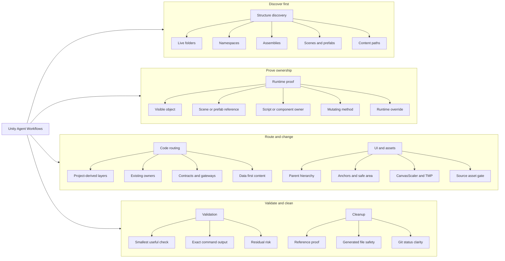
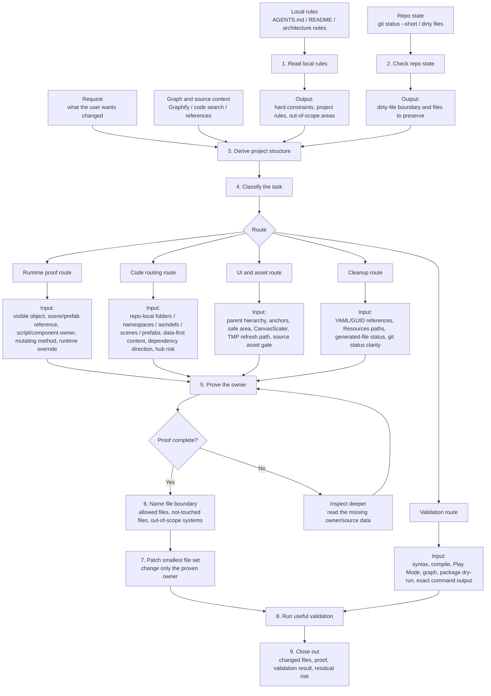

# Unity 2D Game Agent Workflows

[](https://github.com/AUN-PN/unity-agent-workflows/actions/workflows/publish.yml)
[](#add-in-codex-plugins-from-git)
[](https://skills.sh/AUN-PN/unity-agent-workflows/unity-agent-workflows)

[ภาษาไทย](README.th.md)

A Codex skill and npx installer for Unity 2D game projects where AI agents touch real game code, scenes, prefabs, UI, and gameplay systems.

It gives Codex, Claude Code, Unity MCP Server, and Unity AI Assistant style workflows a safer route through Unity 2D gameplay automation: discover the project structure first, prove the runtime owner, then patch the code or asset path that actually drives what the player sees.

It is especially tuned for sprites, tiles, UI/HUD, `Collider2D`, pooled enemies, runtime clones, scene/prefab references, and AI-assisted Unity refactoring where "the code compiled" is not enough.

I made this after running into the same Unity-agent problems over and over: the agent assumes a fixed architecture, edits the nearby script instead of the runtime owner, changes prefab or scene values that get overwritten in Play mode, grows one more huge controller, or says "validated" without proving the path that actually runs.

This skill is the guardrail set I wish every Unity coding agent, AI coding assistant for Unity, Codex agent, Claude Code Unity MCP workflow, or editor-assisted Unity automation had loaded before touching a game project.

## What It Helps With

Use it when an AI agent is working on Unity game code and the task needs more discipline than "grep a name and patch the first match."

It is especially useful for:

- runtime-visible bugs where the edited value might not be the value the player sees in Play Mode
- UI fixes that depend on parent hierarchy, anchors, safe area, CanvasScaler, or TMP refresh paths
- focus rings, tutorial spotlights, modal dimming, or visible target binding for buttons, icons, cards, HUD slots, markers, colliders, units, props, and VFX anchors where the agent must use the real runtime object instead of guessed coordinates
- duplicate Unity object names where `GameObject.Find(name)` or first-match search can select the wrong target
- project structure discovery before the agent adds new scripts, namespaces, assemblies, or content paths
- Unity 2D games with repeated sprites, tiles, pooled enemies, `Collider2D` objects, or runtime clones that share the same visible name but are different live targets
- prefab and scene wiring where an AI assistant needs to set references, components, and UI objects without losing runtime validation
- compile/test/debug loops where passing C# syntax is not enough; the agent must prove the Play Mode behavior still matches the request
- modular C# work where new responsibility needs the repo's actual folder, namespace, assembly, and dependency direction
- gameplay content changes that should go through data/config instead of hardcoded one-offs
- cleanup work where deleted files need real reference proof
- repeated "still not fixed" passes where the agent needs to stop changing random constants
- Unity MCP or editor-assisted workflows where the agent needs a clear route before touching scenes, prefabs, or C# scripts

The main rule is simple:

```text
No proof, no edit.
```

For visible Unity behavior, proof means tracing the owner chain:

```text
visible object -> scene/prefab/reference -> script/component -> mutating method -> serialized/runtime override
```

If that chain is missing, the agent has not earned the patch yet.

## Mindmap

This is the mental model I use when deciding whether the agent is allowed to edit.



## Data Flow by Step

The mindmap is not just a list of topics. Each branch feeds a specific step, and each step must produce something useful before the agent moves on.



Here is the same flow in a more practical table:

| Mindmap branch | Enters step | What it carries | Required output before moving on |
|---|---:|---|---|
| Runtime proof | Step 5 | visible object, scene/prefab link, script/component, mutating method, runtime override | owner chain that proves where the live behavior is controlled |
| Structure discovery | Step 1-4 | repo docs, folders, namespaces, asmdefs, scenes, prefabs, graph/source proof | project-derived structure map before routing |
| Code routing | Step 4-6 | repo-local owners/layers, data source, dependency direction, hub risk | route choice, Routing Card when structural work is needed, and a file boundary |
| UI and assets | Step 4-7 | hierarchy, anchors, safe area, CanvasScaler, TMP, asset gate | layout owner or asset decision; PixelLab only when a new/replaced source visual asset is required |
| Validation | Step 8-9 | smallest useful check, exact command output, known gaps | validation result and residual risk that can be reported honestly |
| Cleanup | Step 4-9 | YAML/GUID refs, `Resources.Load` paths, generated-file status, git status | deletion/keep proof, safe cleanup scope, and clean Git explanation |

The important bit: data does not jump straight from "I found a file" to "I edited it." It has to pass through live structure discovery, classification, owner proof, file boundary, patch, validation, and closeout.

## Install

### Add in Codex Plugins from Git

This repo can be added to Codex as a plugin marketplace. In Codex, open Plugins, choose Add marketplace, then use:

```text
Source:
https://github.com/AUN-PN/unity-agent-workflows.git

Git ref:
main

Sparse paths:
```

Leave `Sparse paths` empty. The placeholder `plugins/codex` is only an example.

The marketplace entry is defined by:

```text
.agents/plugins/marketplace.json
plugins/unity-agent-workflows/.codex-plugin/plugin.json
plugins/unity-agent-workflows/skills/unity-agent-workflows/SKILL.md
```

After adding the marketplace, install or enable `Unity Workflows` from the Codex Plugins list.

### Install as a local skill

Install with npx only:

```bash
npx unity-agent-workflows
```

Install to both Codex and Claude-style skill folders:

```bash
npx unity-agent-workflows --target both
```

Preview the install without writing files:

```bash
npx unity-agent-workflows --dry-run
```

By default the installer writes to:

```text
~/.codex/skills/unity-agent-workflows
```

If that folder already exists, the installer backs it up with a timestamp before replacing it.

## Use

Use this skill in small passes. One short Teach command creates a structure index and focused maps, then later tasks read only the map they need.

### 1. Teach Once

Run this in a Unity repo:

```text
$unity-agent-workflows. Teach
```

The skill will create/refresh `UNITY_STRUCTURE.md` as a short index and split details by category automatically:

```text
UNITY_STRUCTURE.md
UNITY_STRUCTURE.ui.md
UNITY_STRUCTURE.gameplay.md
UNITY_STRUCTURE.content.md
UNITY_STRUCTURE.assemblies.md
UNITY_STRUCTURE.cleanup.md
```

It should create only useful category files. It must not scan unrelated systems just to fill every template.

### 2. Auto File Routing

After Teach, agents should read only the index plus the matching focused map:

| Task | Read |
|---|---|
| UI, HUD, menu, safe area, TMP, visible target | `UNITY_STRUCTURE.md`, `UNITY_STRUCTURE.ui.md` |
| Gameplay behavior, enemies, stages, skills, missions | `UNITY_STRUCTURE.md`, `UNITY_STRUCTURE.gameplay.md` |
| Balance, localization, ScriptableObjects, config | `UNITY_STRUCTURE.md`, `UNITY_STRUCTURE.content.md` |
| New files, refactor, asmdef, namespace, dependency | `UNITY_STRUCTURE.md`, `UNITY_STRUCTURE.assemblies.md` |
| Deletion, cleanup, generated files, Resources/addressables | `UNITY_STRUCTURE.md`, `UNITY_STRUCTURE.cleanup.md` |

### 3. Use The Structure Map

Short game-session prompts:

| Prompt | Routed maps |
|---|---|
| `Move the HUD skill dock to the bottom-right; it overlaps the Earth.` | `UNITY_STRUCTURE.md`, `UNITY_STRUCTURE.ui.md` |
| `Make the Sentinel ship clearly pass behind the Earth.` | `UNITY_STRUCTURE.md`, `UNITY_STRUCTURE.gameplay.md` |
| `Check every file related to the duplicated overlay and fix it.` | `UNITY_STRUCTURE.md`, `UNITY_STRUCTURE.ui.md`, `UNITY_STRUCTURE.cleanup.md` |
| `Do not fix yet; first check why the ship pauses while flying.` | `UNITY_STRUCTURE.md`, `UNITY_STRUCTURE.gameplay.md` |

### 4. Refresh Only What Is Stale

If a focused map is missing or stale, refresh only that map:

```text
Use $unity-agent-workflows.
Refresh only UNITY_STRUCTURE.ui.md, then fix this HUD issue.
```

## What Is Inside

```text
unity-agent-workflows/
├── SKILL.md
├── README.md
├── README.th.md
├── package.json
├── agents/
│   └── openai.yaml
├── bin/
│   └── unity-agent-workflows.js
├── references/
│   ├── ai-workflows.md
│   ├── cleanup-and-git.md
│   ├── coordinate-space-conversion.md
│   ├── content-and-systems.md
│   ├── modular-architecture.md
│   ├── project-structure-discovery.md
│   ├── runtime-owner-proof.md
│   ├── runtime-visible-targets.md
│   ├── session-mining.md
│   ├── target-bounds-catalog.md
│   ├── ui-and-visual-assets.md
│   ├── unity-validation.md
│   └── workflow-recipes.md
└── scripts/
    └── validate_skill.sh
```

[SKILL.md](SKILL.md) stays short on purpose. The deeper notes live in `references/` so the agent only loads them when the task calls for it.

## Reference Files

- [ai-workflows.md](references/ai-workflows.md): the general workflow, Routing Card, and closeout shape
- [workflow-recipes.md](references/workflow-recipes.md): optional named recipes `WF-0` through `WF-11`
- [project-structure-discovery.md](references/project-structure-discovery.md): how to learn the user's actual Unity folders, namespaces, assemblies, scenes, prefabs, and optional `UNITY_STRUCTURE.md`
- [runtime-owner-proof.md](references/runtime-owner-proof.md): how to prove the real owner of visible/runtime behavior, then route to deeper target docs only when needed
- [runtime-visible-targets.md](references/runtime-visible-targets.md): focus/highlight/click target rules and hardcoded fallback contracts
- [target-bounds-catalog.md](references/target-bounds-catalog.md): object-type bounds choices for UI/world/VFX/text targets
- [coordinate-space-conversion.md](references/coordinate-space-conversion.md): cross-canvas, world-to-UI, and safe-area coordinate conversion
- [modular-architecture.md](references/modular-architecture.md): project-derived module boundaries, asmdef rules, and hub gates; Core/Systems/Features is only a sample fallback
- [unity-validation.md](references/unity-validation.md): compile checks, stale response files, Roslyn/Bee notes, and validation levels
- [ui-and-visual-assets.md](references/ui-and-visual-assets.md): UI layout, mobile readability, safe areas, localization, and visual asset gates
- [content-and-systems.md](references/content-and-systems.md): gameplay data, progression, stages, waves, and system readiness
- [cleanup-and-git.md](references/cleanup-and-git.md): safe deletion, generated files, commit hygiene, and push proof
- [session-mining.md](references/session-mining.md): turning old agent lessons into durable rules without dumping raw chat into the skill

## What This Is Not

This is not a replacement for Unity Play Mode, device testing, code review, or a project's own `AGENTS.md`.

It also will not assume your project structure. It forces the agent to read the live repo, derive the current structure, prove the owner chain, and explain what it changed. That is the point.

## License

No license is specified yet. Add a `LICENSE` file before public reuse or outside contribution.
