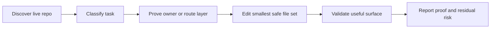

# Unity Game AI Workflows

AI operating rules for safer Unity game development with Codex-style agents.

This repository packages a reusable AI skill for Unity game work: repo discovery, runtime-owner proof, modular C# routing, asmdef boundaries, UI and scene safety, visual asset gating, validation, cleanup proof, and durable workflow mining.

The agent entrypoint is [SKILL.md](SKILL.md). This README is the human-facing GitHub page.

## Why This Exists

Unity projects are easy for AI agents to edit in the wrong place. A searched constant, prefab value, or nearby script can look correct while the visible runtime behavior is actually owned by a presenter, factory, layout writer, service, animation path, or scene override.

This skill turns those lessons into a repeatable workflow:

- Read the live project before acting.
- Prove the real runtime owner before editing visible behavior.
- Route new C# responsibility to the right layer.
- Keep cross-feature communication behind contracts, events, gateways, or bridges.
- Use source visual assets before Unity integration code.
- Validate the smallest useful surface and report exact proof.

## Best For

Use this skill when a Unity game task involves:

| Task | What the skill enforces |
| --- | --- |
| Runtime-visible bug fixes | Visible object to scene/prefab reference to script/component to mutating method proof |
| New gameplay features | Layer routing, data-first content, no broad controller growth |
| Modular C# changes | Core, Contracts, Systems, Features, asmdef, and dependency-boundary checks |
| UI or screenshot fixes | Parent, anchor, CanvasScaler, TMP, safe-area, and runtime layout ownership checks |
| Visual source assets | Asset gate before code integration |
| Validation repair | Exact compiler/runtime errors, stale response-file checks, rerun proof |
| Cleanup or deletion | Source-vs-generated proof, GUID/search reachability, clean git reporting |
| Workflow mining | Durable rule extraction without copying raw session noise |

## How It Works



Core rule: no proof, no edit.

For visible changes, the required chain is:

```text
visible object -> scene/prefab/reference -> script/component -> mutating method -> serialized/runtime override
```

For structural code changes, the agent fills the Routing Card in [SKILL.md](SKILL.md) before editing.

## Quick Start

Install with `npx` from the private GitHub repo now:

```bash
npx git+ssh://git@github.com/Aun-Phuwanan/unity-game-ai-workflows.git
```

If the GitHub repo is public, the shorthand also works:

```bash
npx github:Aun-Phuwanan/unity-game-ai-workflows
```

After the package is published to npm, install with:

```bash
npx unity-game-ai-workflows
```

Install for both Codex and Claude-style skill folders:

```bash
npx unity-game-ai-workflows --target both
```

Preview without writing files:

```bash
npx unity-game-ai-workflows --dry-run
```

The installer writes to `~/.codex/skills/unity-game-ai-workflows` by default. If a previous install exists, it creates a timestamped backup before replacing it.

Manual Git install also works:

```bash
git clone git@github.com:Aun-Phuwanan/unity-game-ai-workflows.git ~/.codex/skills/unity-game-ai-workflows
```

Invoke it in a prompt:

```text
Use $unity-game-ai-workflows to route, implement, and validate this Unity gameplay change safely.
```

Validate the local skill package:

```bash
bash scripts/validate_skill.sh
```

## Repository Layout

```text
unity-game-ai-workflows/
├── SKILL.md
├── README.md
├── package.json
├── agents/
│   └── openai.yaml
├── bin/
│   └── unity-game-ai-workflows.js
├── references/
│   ├── ai-workflows.md
│   ├── cleanup-and-git.md
│   ├── content-and-systems.md
│   ├── modular-architecture.md
│   ├── runtime-owner-proof.md
│   ├── session-mining.md
│   ├── ui-and-visual-assets.md
│   └── unity-validation.md
└── scripts/
    └── validate_skill.sh
```

## Reference System

The skill keeps [SKILL.md](SKILL.md) compact and loads deeper references only when the task needs them.

| Reference | Use when |
| --- | --- |
| [ai-workflows.md](references/ai-workflows.md) | Routing Card, universal workflow, closeout format |
| [modular-architecture.md](references/modular-architecture.md) | New scripts, moved responsibility, asmdef, hub gates |
| [runtime-owner-proof.md](references/runtime-owner-proof.md) | Visible bugs, repeated "still wrong" fixes, runtime override tracing |
| [unity-validation.md](references/unity-validation.md) | Compile checks, runtime-facing validation, stale response-file repair |
| [ui-and-visual-assets.md](references/ui-and-visual-assets.md) | Mobile UI, safe area, localization, visual asset gates |
| [content-and-systems.md](references/content-and-systems.md) | Stages, waves, progression, data-first gameplay content |
| [cleanup-and-git.md](references/cleanup-and-git.md) | Safe cleanup, deletion proof, commit and push hygiene |
| [session-mining.md](references/session-mining.md) | Turning prior agent lessons into durable workflow rules |

## README Page System

This README is intentionally structured for GitHub scanning:

1. Identity: what the skill is and what problem it solves.
2. Use cases: when a Unity agent should load it.
3. Workflow spine: the repeatable operating loop.
4. Quick start: install, invoke, validate.
5. Repository map: where each file belongs.
6. Reference index: progressive disclosure instead of loading every rule at once.
7. Guarantees and limits: what the skill enforces, and what it does not replace.

This keeps the GitHub page useful to humans while the actual agent instructions remain in [SKILL.md](SKILL.md).

## Guarantees

This skill is designed to make an AI agent:

- Inspect before editing.
- Preserve unrelated dirty files.
- Avoid guessing by filename proximity.
- Avoid growing large Unity hubs.
- Separate source assets from integration code.
- Report exact validation commands and results.

It does not replace Unity Play Mode, device testing, design review, code-owner review, or project-specific `AGENTS.md` instructions.

## Research Basis

The README structure follows public documentation patterns:

- GitHub READMEs should explain what the project does, why it is useful, how to get started, where to get help, and who maintains it: [GitHub Docs - About READMEs](https://docs.github.com/articles/about-readmes/).
- Open Source Guides recommends a root README that answers what the project does, why it matters, how to start, and how to get help: [Starting an Open Source Project - Writing a README](https://opensource.guide/starting-a-project/#writing-a-readme).
- Skill packages should keep `SKILL.md` as the required agent entrypoint, with optional references and scripts for supporting material: [OpenAI skill-creator](https://github.com/openai/skills/blob/main/skills/.system/skill-creator/SKILL.md) and [Claude Code skills](https://code.claude.com/docs/en/skills).
- `npx` runs commands from local or remote npm packages, and npm uses the `bin` field in `package.json` to expose executables: [npm exec](https://docs.npmjs.com/cli/v11/commands/npm-exec/) and [package.json bin](https://docs.npmjs.com/cli/v11/configuring-npm/package-json#bin).

## License

No license is specified yet. Add a `LICENSE` file before public reuse or contribution.
