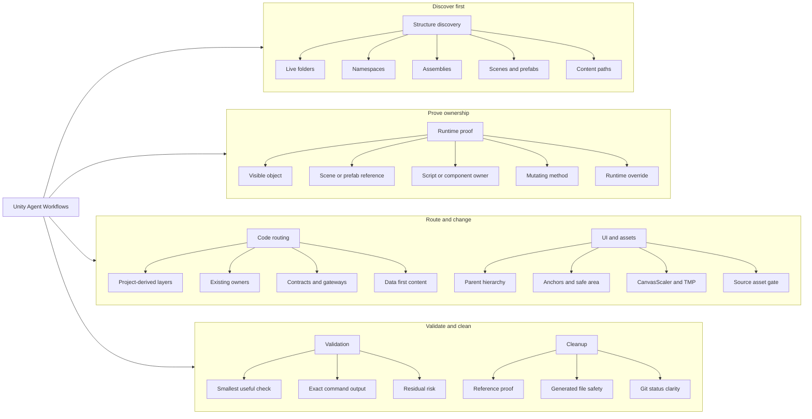

# Unity Agent Workflows

[English](README.md)

Codex skill และ `npx` installer สำหรับทำงาน Unity กับ AI agent ให้ปลอดภัยขึ้น: อ่านโครงสร้างโปรเจ็คจริงก่อน, พิสูจน์ runtime owner ก่อนแก้, route โค้ดเข้าที่ที่ถูกต้อง, validate ด้วย command ที่ตรวจซ้ำได้

ใช้เมื่อต้องให้ AI coding agent แก้ Unity game แล้วไม่อยากให้เดาจากชื่อไฟล์ใกล้ๆ หรือยัด logic เพิ่มใน controller ใหญ่โดยไม่พิสูจน์ว่า path นั้นคือ path ที่รันจริง

กฎหลัก:

```text
No proof, no edit.
```

สำหรับ behavior ที่ผู้เล่นเห็น ต้องไล่ owner chain ให้ครบ:

```text
visible object -> scene/prefab/reference -> script/component -> mutating method -> serialized/runtime override
```

ถ้า chain นี้ยังไม่ครบ agent ยังไม่ควร patch

## ช่วยเรื่องอะไร

- bug ที่เห็นใน runtime แต่ค่าใน prefab/scene อาจถูก override ตอน Play mode
- UI ที่ขึ้นกับ parent hierarchy, anchors, safe area, CanvasScaler, TMP refresh
- focus ring, tutorial spotlight, modal dimming, visible target binding
- object ชื่อซ้ำที่ `GameObject.Find(name)` หรือ first-match search อาจจับผิดตัว
- งาน C# structural/refactor ที่ต้องใช้ folder, namespace, assembly, dependency direction ของ repo จริง
- gameplay content ที่ควรผ่าน data/config แทน hardcoded branch
- cleanup ที่ต้องพิสูจน์ reference ก่อนลบ
- งานที่แก้ซ้ำแล้ว “ยังไม่เห็นผล” เพราะแก้ผิด runtime owner

## แนวคิดการทำงาน



## Flow หลัก

```text
1. Read local rules
2. Check repo state
3. Derive project structure
4. Classify the task
5. Prove the owner
6. Name file boundary
7. Patch smallest file set
8. Run useful validation
9. Close out with proof
```

ตารางสั้น:

| Branch | ใช้ตอนไหน | ต้องได้อะไรก่อนแก้ |
|---|---|---|
| Structure discovery | ก่อนงาน structural/refactor/new system | project-derived structure map |
| Runtime proof | งาน visible/runtime bug | owner chain ที่ควบคุม behavior จริง |
| Code routing | งานเพิ่ม/ย้าย responsibility | route ตาม folder/namespace/asmdef จริงของ repo |
| UI and assets | งาน UI/visual/source asset | layout owner หรือ asset decision |
| Validation | ก่อน closeout | command/result ที่ตรวจซ้ำได้ |
| Cleanup | งานลบ/จัดระเบียบ | reference proof และขอบเขตที่ไม่แตะ |

## ติดตั้ง

ติดตั้งด้วย `npx`:

```bash
npx unity-agent-workflows
```

ติดตั้งลงทั้ง Codex และ Claude-style skill folders:

```bash
npx unity-agent-workflows --target both
```

ดู preview โดยไม่เขียนไฟล์:

```bash
npx unity-agent-workflows --dry-run
```

ตำแหน่ง default:

```text
~/.codex/skills/unity-agent-workflows
```

ถ้า folder นี้มีอยู่แล้ว installer จะ backup ด้วย timestamp ก่อน replace

## วิธีใช้

ให้ agent โหลด skill ก่อนทำงาน Unity:

```text
Use $unity-agent-workflows to route, implement, and validate this Unity gameplay change safely.
```

สำหรับ bug แคบ:

```text
Use $unity-agent-workflows.
Prove the runtime owner first.
Patch the smallest file set and show the validation command.
```

สำหรับงาน structural:

```text
Use $unity-agent-workflows.
Derive this repo's actual project structure first.
Fill the Routing Card before editing.
Patch only the proven owner path.
```

## สอนโครงสร้างโปรเจ็คก่อน

สำหรับ Unity repo ใหม่ ให้รัน structure pass ก่อนสั่ง refactor หรือเพิ่ม system ใหม่ เพื่อให้ agent รู้ว่า repo นี้จัด folder/module/asmdef/scene/prefab อย่างไรจริงๆ

```text
Use $unity-agent-workflows.
Teach/document this Unity project structure first.
Create or refresh UNITY_STRUCTURE.md from the live repo.
```

agent ควร inspect ของจริงใน repo:

- repo instructions: `AGENTS.md`, `README.md`, architecture docs, ADRs
- script roots, folders, namespaces, `.asmdef` files
- scenes, prefabs, bootstraps, composition roots
- ScriptableObjects, config, localization, addressables/resources
- graph reports เช่น `graphify-out/GRAPH_REPORT.md`, `graphify-out/wiki/index.md`, `graph.json`
- generated/build/cache folders ที่ไม่ควรแก้

`UNITY_STRUCTURE.md` ควรตอบคำถามเหล่านี้:

```text
Where do scripts live?
What are the module/layer names in this repo?
Which assemblies depend on which assemblies?
Which scenes/prefabs own runtime UI or gameplay objects?
Where does content/data live?
How do modules communicate?
What validation commands exist?
What files/folders should agents avoid?
```

หลังสร้าง map แล้ว ใช้กับงานจริง:

```text
Use $unity-agent-workflows.
Read UNITY_STRUCTURE.md first.
Implement this change using the repo's existing structure.
Do not invent Core/Systems/Features unless this repo already uses them.
Show the runtime owner, files touched, and validation command.
```

ถ้า `UNITY_STRUCTURE.md` stale ให้ refresh เฉพาะส่วน:

```text
Use $unity-agent-workflows.
Refresh the UI/runtime-owner parts of UNITY_STRUCTURE.md, then fix this HUD issue.
```

## ไฟล์ข้างใน

```text
unity-agent-workflows/
├── SKILL.md
├── README.md
├── README.th.md
├── package.json
├── agents/
│   └── openai.yaml
├── bin/
│   └── unity-agent-workflows.js
├── references/
│   ├── ai-workflows.md
│   ├── cleanup-and-git.md
│   ├── content-and-systems.md
│   ├── modular-architecture.md
│   ├── project-structure-discovery.md
│   ├── runtime-owner-proof.md
│   ├── session-mining.md
│   ├── ui-and-visual-assets.md
│   └── unity-validation.md
└── scripts/
    └── validate_skill.sh
```

## Reference Files

- [ai-workflows.md](references/ai-workflows.md): workflow หลัก, Routing Card, recipes, closeout
- [project-structure-discovery.md](references/project-structure-discovery.md): อ่านโครงสร้างจริงของ Unity repo และ optional `UNITY_STRUCTURE.md`
- [runtime-owner-proof.md](references/runtime-owner-proof.md): พิสูจน์ owner ของ visible/runtime behavior
- [modular-architecture.md](references/modular-architecture.md): project-derived module boundaries, asmdef rules, hub gates
- [unity-validation.md](references/unity-validation.md): compile checks, Roslyn/Bee, validation levels
- [ui-and-visual-assets.md](references/ui-and-visual-assets.md): UI layout, mobile readability, safe area, localization, visual asset gates
- [content-and-systems.md](references/content-and-systems.md): gameplay data, progression, stages, waves, system readiness
- [cleanup-and-git.md](references/cleanup-and-git.md): safe deletion, generated files, commit hygiene
- [session-mining.md](references/session-mining.md): แปลง lesson จาก session เก่าเป็น durable rules

## Validate

```bash
bash scripts/validate_skill.sh
```

สำหรับ npm package:

```bash
npm pack --dry-run
npm publish --dry-run
```

package name:

```text
unity-agent-workflows
```

## ข้อจำกัด

ไม่แทน Unity Play Mode, device testing, code review, หรือ project-local `AGENTS.md`

skill นี้ไม่ assume โครงสร้างโปรเจ็คของคุณ มันบังคับให้ agent อ่าน repo จริง, derive structure, prove owner chain, แล้วรายงานว่าแก้อะไรและตรวจอย่างไร

## License

ยังไม่มี `LICENSE` file ควรเพิ่มก่อน public reuse หรือรับ contribution ภายนอก
