# Unity 2D Game Agent Workflows

[](https://github.com/AUN-PN/unity-agent-workflows/actions/workflows/publish.yml)
[](https://skills.sh/AUN-PN/unity-agent-workflows/unity-agent-workflows)

[English](README.md)

Codex skill และ `npx` installer สำหรับโปรเจ็ค Unity 2D game ที่ให้ AI agent แตะโค้ดจริง, scene, prefab, UI และ gameplay system

มันช่วยให้ Codex, Claude Code, Unity MCP Server และ workflow แบบ Unity AI Assistant เดินงาน Unity 2D gameplay automation ได้ปลอดภัยขึ้น: อ่านโครงสร้างโปรเจ็คก่อน, พิสูจน์ runtime owner, แล้วค่อยแก้ path ที่ทำให้สิ่งบนจอเปลี่ยนจริง

เหมาะกับงาน sprite, tile, UI/HUD, `Collider2D`, pooled enemy, runtime clone, scene/prefab reference และ AI-assisted Unity refactoring ที่แค่ compile ผ่านยังไม่พอ ต้องตรงกับสิ่งที่ผู้เล่นเห็นจริง

ผมทำ skill นี้เพราะเจอปัญหาเดิมซ้ำๆ: agent เดา architecture, แก้ไฟล์ใกล้มือแทน runtime owner, เปลี่ยนค่าใน prefab/scene แล้วโดน override ตอน Play Mode, เพิ่ม logic เข้า controller ใหญ่ขึ้นเรื่อยๆ หรือบอกว่า validate แล้วทั้งที่ยังไม่ได้พิสูจน์ path ที่รันจริง

กฎหลัก:

```text
No proof, no edit.
```

สำหรับ behavior ที่ผู้เล่นเห็น ต้องไล่ owner chain ให้ครบ:

```text
visible object -> scene/prefab/reference -> script/component -> mutating method -> serialized/runtime override
```

ถ้า chain นี้ยังไม่ครบ agent ยังไม่ควร patch

## ช่วยเรื่องอะไร

- bug ที่เห็นใน runtime แต่ค่าใน prefab/scene อาจถูก override ตอน Play mode
- UI ที่ขึ้นกับ parent hierarchy, anchors, safe area, CanvasScaler, TMP refresh
- focus ring, tutorial spotlight, modal dimming, visible target binding
- object ชื่อซ้ำที่ `GameObject.Find(name)` หรือ first-match search อาจจับผิดตัว
- การอ่าน project structure ก่อนให้ agent เพิ่ม script, namespace, assembly หรือ content path ใหม่
- เกม Unity 2D ที่มี sprite, tile, pooled enemy, `Collider2D`, หรือ runtime clone ซ้ำชื่อกัน แต่ target จริงคนละตัว
- prefab/scene wiring ที่ AI assistant ต้อง set reference, component, UI object และยังต้องมี runtime validation
- compile/test/debug loop ที่แค่ C# compile ผ่านยังไม่พอ ต้องพิสูจน์ Play Mode behavior ว่าตรง request
- งาน C# structural/refactor ที่ต้องใช้ folder, namespace, assembly, dependency direction ของ repo จริง
- gameplay content ที่ควรผ่าน data/config แทน hardcoded branch
- cleanup ที่ต้องพิสูจน์ reference ก่อนลบ
- งานที่แก้ซ้ำแล้ว “ยังไม่เห็นผล” เพราะแก้ผิด runtime owner

## แนวคิดการทำงาน

```mermaid
flowchart LR
    UAW["Unity Agent Workflows"]

    subgraph DISC["Discover first"]
      SD["Structure discovery"]
      SD1["Live folders"]
      SD2["Namespaces"]
      SD3["Assemblies"]
      SD4["Scenes and prefabs"]
      SD5["Content paths"]
      SD --> SD1
      SD --> SD2
      SD --> SD3
      SD --> SD4
      SD --> SD5
    end

    subgraph PROOF["Prove ownership"]
      RP["Runtime proof"]
      RP1["Visible object"]
      RP2["Scene or prefab reference"]
      RP3["Script or component owner"]
      RP4["Mutating method"]
      RP5["Runtime override"]
      RP --> RP1
      RP --> RP2
      RP --> RP3
      RP --> RP4
      RP --> RP5
    end

    subgraph ROUTE["Route and change"]
      CR["Code routing"]
      CR1["Project-derived layers"]
      CR2["Existing owners"]
      CR3["Contracts and gateways"]
      CR4["Data first content"]
      UI["UI and assets"]
      UI1["Parent hierarchy"]
      UI2["Anchors and safe area"]
      UI3["CanvasScaler and TMP"]
      UI4["Source asset gate"]
      CR --> CR1
      CR --> CR2
      CR --> CR3
      CR --> CR4
      UI --> UI1
      UI --> UI2
      UI --> UI3
      UI --> UI4
    end

    subgraph VERIFY["Validate and clean"]
      VA["Validation"]
      VA1["Smallest useful check"]
      VA2["Exact command output"]
      VA3["Residual risk"]
      CL["Cleanup"]
      CL1["Reference proof"]
      CL2["Generated file safety"]
      CL3["Git status clarity"]
      VA --> VA1
      VA --> VA2
      VA --> VA3
      CL --> CL1
      CL --> CL2
      CL --> CL3
    end

    UAW --> DISC
    UAW --> PROOF
    UAW --> ROUTE
    UAW --> VERIFY
```



## Flow หลัก

```text
1. Read local rules
2. Check repo state
3. Derive project structure
4. Classify the task
5. Prove the owner
6. Name file boundary
7. Patch smallest file set
8. Run useful validation
9. Close out with proof
```

ตารางสั้น:

| Branch | ใช้ตอนไหน | ต้องได้อะไรก่อนแก้ |
|---|---|---|
| Structure discovery | ก่อนงาน structural/refactor/new system | project-derived structure map |
| Runtime proof | งาน visible/runtime bug | owner chain ที่ควบคุม behavior จริง |
| Code routing | งานเพิ่ม/ย้าย responsibility | route ตาม folder/namespace/asmdef จริงของ repo |
| UI and assets | งาน UI/visual/source asset | layout owner หรือ asset decision |
| Validation | ก่อน closeout | command/result ที่ตรวจซ้ำได้ |
| Cleanup | งานลบ/จัดระเบียบ | reference proof และขอบเขตที่ไม่แตะ |

## ติดตั้ง

ติดตั้งด้วย `npx`:

```bash
npx unity-agent-workflows
```

ติดตั้งลงทั้ง Codex และ Claude-style skill folders:

```bash
npx unity-agent-workflows --target both
```

ดู preview โดยไม่เขียนไฟล์:

```bash
npx unity-agent-workflows --dry-run
```

ตำแหน่ง default:

```text
~/.codex/skills/unity-agent-workflows
```

ถ้า folder นี้มีอยู่แล้ว installer จะ backup ด้วย timestamp ก่อน replace

## วิธีใช้

ใช้เป็นรอบเล็กๆ: คำสั่ง Teach สั้นๆ จะสร้าง index และแยกเอกสารตามหมวดอัตโนมัติ จากนั้นงานจริงอ่านเฉพาะ map ที่ต้องใช้

### 1. Teach ครั้งเดียว

รันใน Unity repo:

```text
$unity-agent-workflows. Teach
```

skill จะสร้าง/refresh `UNITY_STRUCTURE.md` เป็น index สั้นๆ และแยกรายละเอียดตามหมวดอัตโนมัติ:

```text
UNITY_STRUCTURE.md
UNITY_STRUCTURE.ui.md
UNITY_STRUCTURE.gameplay.md
UNITY_STRUCTURE.content.md
UNITY_STRUCTURE.assemblies.md
UNITY_STRUCTURE.cleanup.md
```

สร้างเฉพาะหมวดที่มีประโยชน์จริง ห้าม scan ระบบไม่เกี่ยวข้องเพื่อกรอก template ให้ครบ

### 2. เลือกไฟล์อ่านอัตโนมัติ

หลัง Teach แล้ว agent ควรอ่านเฉพาะ index + focused map ที่ตรงกับงาน:

| งาน | อ่าน |
|---|---|
| UI, HUD, menu, safe area, TMP, visible target | `UNITY_STRUCTURE.md`, `UNITY_STRUCTURE.ui.md` |
| Gameplay behavior, enemies, stages, skills, missions | `UNITY_STRUCTURE.md`, `UNITY_STRUCTURE.gameplay.md` |
| Balance, localization, ScriptableObjects, config | `UNITY_STRUCTURE.md`, `UNITY_STRUCTURE.content.md` |
| New files, refactor, asmdef, namespace, dependency | `UNITY_STRUCTURE.md`, `UNITY_STRUCTURE.assemblies.md` |
| Deletion, cleanup, generated files, Resources/addressables | `UNITY_STRUCTURE.md`, `UNITY_STRUCTURE.cleanup.md` |

### 3. ใช้ Structure Map ทำงานจริง

สำหรับงานจริง:

```text
Use $unity-agent-workflows.
Use the matching UNITY_STRUCTURE map for this task.
Implement this change using the repo's existing structure.
Do not invent Core/Systems/Features unless this repo already uses them.
Show the runtime owner, files touched, and validation command.
```

สำหรับ visible/runtime bug ให้ scope แคบ:

```text
Use $unity-agent-workflows.
Use the matching UNITY_STRUCTURE map for this task.
Prove the runtime owner first.
Patch the smallest file set and show the validation command.
```

### 4. Refresh เฉพาะส่วนที่ stale

ถ้า focused map ไม่มีหรือ stale ให้ refresh เฉพาะไฟล์นั้น:

```text
Use $unity-agent-workflows.
Refresh only UNITY_STRUCTURE.ui.md, then fix this HUD issue.
```

## ไฟล์ข้างใน

```text
unity-agent-workflows/
├── SKILL.md
├── README.md
├── README.th.md
├── package.json
├── agents/
│   └── openai.yaml
├── bin/
│   └── unity-agent-workflows.js
├── references/
│   ├── ai-workflows.md
│   ├── cleanup-and-git.md
│   ├── content-and-systems.md
│   ├── modular-architecture.md
│   ├── project-structure-discovery.md
│   ├── runtime-owner-proof.md
│   ├── session-mining.md
│   ├── ui-and-visual-assets.md
│   └── unity-validation.md
└── scripts/
    └── validate_skill.sh
```

## Reference Files

- [ai-workflows.md](references/ai-workflows.md): workflow หลัก, Routing Card, recipes, closeout
- [project-structure-discovery.md](references/project-structure-discovery.md): อ่านโครงสร้างจริงของ Unity repo และ optional `UNITY_STRUCTURE.md`
- [runtime-owner-proof.md](references/runtime-owner-proof.md): พิสูจน์ owner ของ visible/runtime behavior
- [modular-architecture.md](references/modular-architecture.md): project-derived module boundaries, asmdef rules, hub gates
- [unity-validation.md](references/unity-validation.md): compile checks, Roslyn/Bee, validation levels
- [ui-and-visual-assets.md](references/ui-and-visual-assets.md): UI layout, mobile readability, safe area, localization, visual asset gates
- [content-and-systems.md](references/content-and-systems.md): gameplay data, progression, stages, waves, system readiness
- [cleanup-and-git.md](references/cleanup-and-git.md): safe deletion, generated files, commit hygiene
- [session-mining.md](references/session-mining.md): แปลง lesson จาก session เก่าเป็น durable rules

## ข้อจำกัด

ไม่แทน Unity Play Mode, device testing, code review, หรือ project-local `AGENTS.md`

skill นี้ไม่ assume โครงสร้างโปรเจ็คของคุณ มันบังคับให้ agent อ่าน repo จริง, derive structure, prove owner chain, แล้วรายงานว่าแก้อะไรและตรวจอย่างไร

## License

ยังไม่มี `LICENSE` file ควรเพิ่มก่อน public reuse หรือรับ contribution ภายนอก
