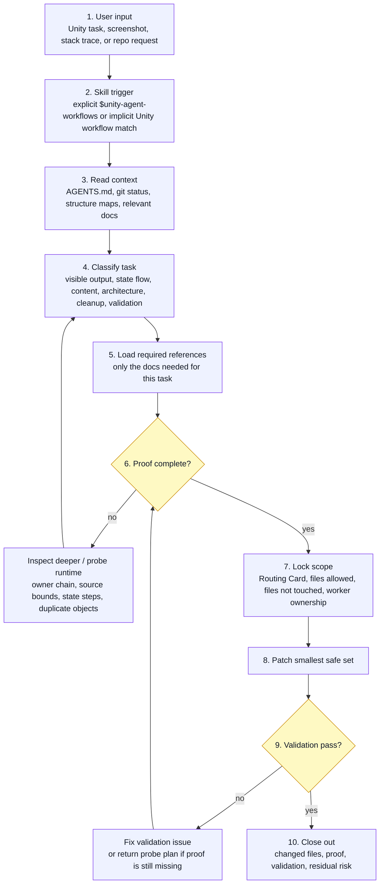
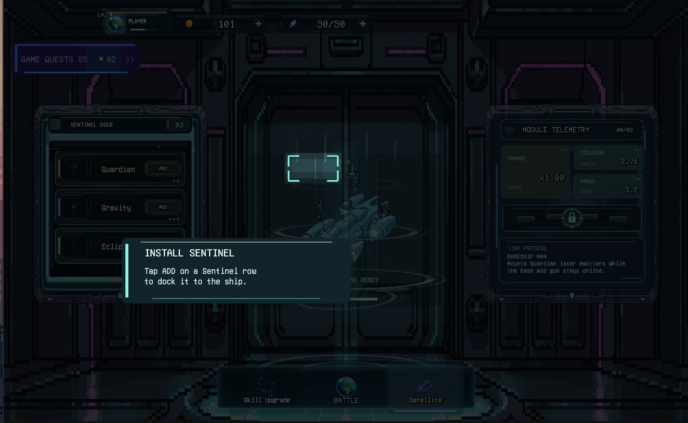

# Unity Game Agent Workflows

[](https://github.com/AUN-PN/unity-agent-workflows/actions/workflows/publish.yml)
[](https://www.npmjs.com/package/unity-agent-workflows)
[](#ติดตั้งเป็น-codex-plugin)

[English](README.md)

Codex plugin, Codex skill และ `npx` installer สำหรับงาน AI-assisted Unity 2D game

ใช้เมื่อ agent ต้องแตะไฟล์ Unity จริง แต่ต้องพิสูจน์ก่อนว่า path ไหนควบคุมสิ่งที่ผู้เล่นเห็นจริง: local rules, project structure, scene/prefab references, runtime owner, mutation path และ validation

| Surface                   | Name                    |
| ------------------------- | ----------------------- |
| npm package               | `unity-agent-workflows` |
| Codex plugin display name | `Unity Workflows`       |
| Skill name                | `unity-agent-workflows` |
| Skill title               | `Unity Agent Workflows` |

กฎหลัก:

```text
No proof, no edit.
```

## ทำไมต้องใช้

Unity agents มักพลาดแบบเดิม: แก้ script ใกล้มือ, เชื่อ scene YAML ที่โดน override ตอน Play Mode, จับ object ชื่อซ้ำผิดตัว, เพิ่ม logic เข้า controller ใหญ่ขึ้นเรื่อยๆ หรือบอกว่า validate แล้วทั้งที่ตรวจแค่ syntax

plugin นี้บังคับ workflow ที่เข้มขึ้นสำหรับ Unity 2D:

- อ่าน project-local instructions ก่อนแตะไฟล์
- รักษา unrelated dirty work
- derive folders, namespaces, assemblies, scenes, prefabs และ content paths จาก repo จริง
- prove runtime-visible owner chain ก่อนแก้ UI, HUD, scene, prefab หรือ gameplay
- route C# responsibility ใหม่ไปหา owner เดิมของโปรเจ็ค แทน broad folders
- ผูกงาน UI/safe-area/TMP/coordinate-space กับ runtime hierarchy จริง
- validate ด้วย check ที่เล็กแต่มีประโยชน์ และรายงาน residual risk ตรงๆ
- ต้องมี reference proof ก่อน cleanup/deletion

`runtime-owner proof` เป็น workflow heuristic ของโปรเจ็คนี้ ไม่ใช่ Unity API term โดยอิงจาก GameObject/Component model, serialized fields, prefab overrides และ runtime instantiation behavior ของ Unity

## ขั้นตอนการทำงาน

plugin เริ่มจาก input ของผู้ใช้, route งาน, แล้ววน proof จนกว่าจะ patch ได้ปลอดภัยหรือปิดงานได้



รายละเอียดแต่ละ step:

1. **User input**: รับ Unity task, screenshot, stack trace, feature request, cleanup request หรือ validation request
2. **Skill trigger**: เรียก skill จาก `$unity-agent-workflows` หรือ implicit Unity 2D workflow match
3. **Read context**: อ่าน project rules, dirty state, structure maps และ docs ที่เกี่ยวข้อง
4. **Classify task**: แยกงานเป็น visible output, state flow, content, architecture, cleanup หรือ validation
5. **Load references**: `SKILL.md` เลือก reference files ที่ต้องใช้ ไม่โหลดทุก rule
6. **Proof loop**: ถ้า owner chain, overlay/dim source-bound proof, runtime numeric proof หรือ guided state-flow proof ยังไม่ครบ ให้วนกลับไป inspect/probe runtime data
7. **Lock scope**: main agent ระบุ `Files allowed to touch`, `Files explicitly not touched` และ multi-agent ownership ก่อน worker patch
8. **Patch**: แก้เฉพาะ smallest safe file set หลัง proof ครบ
9. **Validation loop**: validation fail ให้วนกลับไป proof/patch; ถ้ายังขาด runtime proof ให้คืน probe plan แทนการเดา
10. **Close out**: สรุป changed files, proof, validation และ residual risk

## ติดตั้งเป็น Codex Plugin

ใน Codex เปิด Plugins, เลือก Add marketplace แล้วใส่:

```text
Source:
https://github.com/AUN-PN/unity-agent-workflows.git

Git ref:
main

Sparse paths:
```

ปล่อย `Sparse paths` ว่างไว้

Codex marketplace metadata อยู่ที่:

```text
.agents/plugins/marketplace.json
plugins/unity-agent-workflows/.codex-plugin/plugin.json
plugins/unity-agent-workflows/skills/unity-agent-workflows/SKILL.md
```

หลัง add marketplace แล้ว install หรือ enable `Unity Workflows` จาก Codex Plugins list

## ติดตั้งเป็น Local Skill

ติดตั้ง skill payload ด้วย `npx`:

```bash
npx unity-agent-workflows
```

ติดตั้งทั้ง Codex และ Claude-style skill folders:

```bash
npx unity-agent-workflows --target both
```

ดู preview โดยไม่เขียนไฟล์:

```bash
npx unity-agent-workflows --dry-run
```

ตำแหน่ง default:

```text
~/.codex/skills/unity-agent-workflows
```

ถ้า target folder มีอยู่แล้ว installer จะ backup ด้วย timestamp ก่อน replace. `npx` installer ติดตั้งเฉพาะ local skill payload; ไม่ได้ add Codex plugin marketplace entry

ตัวเลือก installer:

```text
--target codex|claude|both
--codex
--claude
--all, --both
--dest <path>
--dry-run
--no-backup
--help
--version
```

### Optional skills.sh Discovery

ตรวจ public skill listing:

```bash
npx skills add AUN-PN/unity-agent-workflows --list
```

ติดตั้ง skill ผ่าน `skills` สำหรับ Codex:

```bash
npx skills add AUN-PN/unity-agent-workflows -a codex -y
```

## Quick Start

ใน Unity 2D repo เรียก skill:

```text
$unity-agent-workflows. Teach
```

`Teach` เป็น Codex skill instruction ไม่ใช่ npm CLI command. เมื่อ agent ทำตาม skill จะสร้างหรือ refresh structure index และ focused maps เฉพาะส่วนที่มีประโยชน์:

```text
UNITY_STRUCTURE.md
UNITY_STRUCTURE.ui.md
UNITY_STRUCTURE.runtime.md
UNITY_STRUCTURE.content.md
UNITY_STRUCTURE.assemblies.md
UNITY_STRUCTURE.cleanup.md
```

เพราะ `Teach` เขียนไฟล์ ถ้าต้องการวิเคราะห์ก่อนให้ขอ read-only pass:

```text
Use $unity-agent-workflows.
Do not edit yet. Inspect the project structure and report the proposed UNITY_STRUCTURE map plan.
```

งานถัดไปควรอ่านแค่ `UNITY_STRUCTURE.md` บวก focused map ที่ตรงกับงาน

| งาน                                                                  | อ่าน                                                  |
| -------------------------------------------------------------------- | ----------------------------------------------------- |
| UI, HUD, menu, safe area, TMP, visible target                        | `UNITY_STRUCTURE.md`, `UNITY_STRUCTURE.ui.md`         |
| Runtime behavior, scene objects, interactions, abilities, objectives | `UNITY_STRUCTURE.md`, `UNITY_STRUCTURE.runtime.md`    |
| Balance, localization, ScriptableObjects, config                     | `UNITY_STRUCTURE.md`, `UNITY_STRUCTURE.content.md`    |
| New files, refactor, asmdef, namespace, dependency                   | `UNITY_STRUCTURE.md`, `UNITY_STRUCTURE.assemblies.md` |
| Deletion, cleanup, generated files, Resources/addressables           | `UNITY_STRUCTURE.md`, `UNITY_STRUCTURE.cleanup.md`    |

### เคสตัวอย่าง: FTUE Sentinel Install Focus

บั๊กคือ FTUE Stage 5 Sentinel install focus เพี้ยนซ้ำ: agent แบบไม่ใช้ plugin ทำให้ install prompt ขึ้นได้ แต่ focus ring ไปอยู่แถว ship ไม่ใช่ปุ่ม `ADD` จริง. รอบที่ใช้ `Unity Workflows` บังคับ main-agent scope lock, sub-agent read-only, runtime numeric proof และ checker criteria ก่อน patch

**ก่อนใช้ plugin: focus ยังอยู่ที่ปุ่ม/คำสั่งเมนู Sentinel**


**แก้โดยใช้ `Unity Workflows`: focus ไปอยู่ตำแหน่งปุ่ม Sentinel `ADD` จริง**


**แก้โดยไม่ใช้ plugin rules: install prompt ขึ้น แต่ focus ไปอยู่แถวตำแหน่งยาน ไม่ใช่ `ADD`**



สิ่งที่ plugin เปลี่ยน:

- มองเป็น repeated visible-output failure
- ให้ sub-agent เป็น read-only จนกว่า main agent จะ lock scope
- ต้องมี runtime numeric proof ก่อน patch focus/position ซ้ำ
- checker ต้องเทียบว่า final focus อยู่ที่ปุ่ม `ADD` จริง ไม่ใช่แถวยาน
- กัน unrelated systems ออกจาก scope

Main prompt:

```text
Use $unity-agent-workflows.
Fix the FTUE Stage 5 Sentinel ADD focus mismatch. Treat it as a repeated visible-output failure: spawn read-only sub-agents first, gather runtime numeric proof/checker requirements, lock scope before patching, and do not touch Earth/background/camera/unrelated systems.
```

Prompts ที่ใช้สั่ง sub-agent:

```text
Read-only only. Follow project-local rules and Unity Workflows. Task: inspect the Sentinel ADD focus mismatch state/transition timing only. Find the owner chain from Sentinel menu click to install prompt and ADD focus target. Report state steps: shown/clicked/opened/install prompt/equipped/persisted. Do not edit. Do not include private paths or session IDs.
```

```text
Read-only only. Follow project-local rules and Unity Workflows. Task: inspect the visible focus coordinate path for the Sentinel install ADD target. Prove target object chain, source bounds selection, destination conversion, and final focus ring values. Do not edit. Report exact runtime numeric proof and checker requirements to compare ADD button and final ring. Do not include private paths or session IDs.
```

```text
Read-only only. Follow project-local rules and Unity Workflows. Task: act as checker spec designer for this fix. Determine what a checker must verify after patch: source ADD bounds vs final focus ring bounds, state steps shown/clicked/opened/install/equipped/persisted, and no unrelated systems touched. Do not edit. Return PASS/FAIL criteria. Do not include private paths or session IDs.
```

## Workflow

skill route งานตามลำดับนี้:

```text
1. Read local rules
2. Check repo state
3. Derive live project structure
4. Classify the task
5. Prove owner or route
6. Name the file boundary
7. Patch the smallest safe file set
8. Run useful validation
9. Close out with proof, validation, and residual risk
```

สำหรับ visible Unity behavior ต้องพิสูจน์ chain นี้:

```text
visible object -> scene/prefab/reference -> script/component -> mutating method -> serialized/runtime override
```

ถ้า chain ยังไม่ครบ agent ควร inspect ต่อ หรือถามคำถามเดียวที่ชัดก่อนแก้

## ครอบคลุมอะไร

| Area                      | สิ่งที่ skill บังคับ                                                                                      |
| ------------------------- | --------------------------------------------------------------------------------------------------------- |
| Runtime-visible bugs      | prove object, owner, mutator และ override path                                                            |
| UI/HUD                    | inspect hierarchy, anchors, safe area, `CanvasScaler`, TMP และ runtime builders                           |
| Visible targets           | resolve runtime bounds แทนการเดา hardcoded coordinates                                                    |
| Repeated visible mismatch | บังคับ runtime numeric proof ก่อน patch coordinate, focus, layout, marker หรือ fallback ซ้ำ               |
| Overlay/dim source bounds | reject overlay, mask, blocker หรือ spotlight surfaces เป็น source bounds ยกเว้น explicit marker prove target |
| Coordinate conversion     | ระบุ world, local, screen, viewport, canvas, camera และ safe-area space ชัด                               |
| Guided state flows        | แยก shown/clicked/opened/selected/equipped/claimed/completed/persisted ก่อน mark completion               |
| Multi-agent work          | lock Routing Card, file ownership, runtime proof และ checker gates ก่อน parallel worker patches           |
| C# routing                | derive folders, namespaces, `.asmdef`, dependency direction และ owner modules                             |
| Content changes           | ใช้ data/config surface เดิมก่อน ถ้าโปรเจ็คมี                                                             |
| Validation                | ใช้ check ที่เล็กแต่มีประโยชน์ และรายงาน exact command output                                             |
| Cleanup                   | prove unused status ผ่าน code refs, YAML/GUID refs, Resources/addressables paths และ runtime reachability |

## Reference Files

[SKILL.md](SKILL.md) ตั้งใจให้สั้น ส่วน workflow ลึกอยู่ใน `references/` และโหลดเฉพาะเมื่องานต้องใช้

| File                                                                                   | ใช้ทำอะไร                                                                    |
| -------------------------------------------------------------------------------------- | ---------------------------------------------------------------------------- |
| [references/ai-workflows.md](references/ai-workflows.md)                               | universal workflow, Routing Card, closeout shape                             |
| [references/project-structure-discovery.md](references/project-structure-discovery.md) | live Unity structure discovery และ `UNITY_STRUCTURE.md` maps                 |
| [references/runtime-owner-proof.md](references/runtime-owner-proof.md)                 | runtime-visible owner proof และ repeated-fix diagnostics                     |
| [references/runtime-visible-targets.md](references/runtime-visible-targets.md)         | focus, highlight, click target, marker และ fallback rules                    |
| [references/target-bounds-catalog.md](references/target-bounds-catalog.md)             | UI, 2D world, VFX, safe-area และ TMP bounds choices                          |
| [references/coordinate-space-conversion.md](references/coordinate-space-conversion.md) | world/local/screen/viewport/canvas/camera/safe-area/RenderTexture conversion |
| [references/modular-architecture.md](references/modular-architecture.md)               | project-derived module boundaries, asmdef safety, hub gates                  |
| [references/unity-validation.md](references/unity-validation.md)                       | validation ladder, Unity/Bee/Roslyn notes, MCP checks                        |
| [references/ui-and-visual-assets.md](references/ui-and-visual-assets.md)               | UI layout, mobile readability, safe area, localization, visual asset gates   |
| [references/content-and-systems.md](references/content-and-systems.md)                 | data-first content และ runtime system readiness                              |
| [references/cleanup-and-git.md](references/cleanup-and-git.md)                         | deletion proof, generated files, commit/push hygiene                         |
| [references/session-mining.md](references/session-mining.md)                           | แปลง lesson จาก agent session เก่าเป็น durable rules                         |
| [references/workflow-recipes.md](references/workflow-recipes.md)                       | optional recipes สำหรับ work patterns ที่พบบ่อย                              |

## ตรวจ Package นี้

สำหรับ repo นี้:

```bash
npm run validate
npm run sync:mcpmarket
npm run pack:dry-run
```

`npm run validate` ตรวจ package metadata, plugin manifests, mirrored skill payloads, README architecture coverage, reference links, JavaScript syntax, runtime numeric proof triggers, overlay/dim source-bound gates, guided state-flow gates และ multi-agent scope triggers

`npm run sync:mcpmarket` mirror `SKILL.md`, `references/` และ `agents/` ไปที่:

```text
.claude/skills/unity-agent-workflows/
skills/unity-agent-workflows/
plugins/unity-agent-workflows/skills/unity-agent-workflows/
```

สำหรับ Unity projects ที่ใช้ skill นี้ Unity Editor, Play Mode, Game view, device tests, batchmode builds และ project logs ยังเป็น validation path หลัก. Bee `.rsp` หรือ direct Unity-bundled Roslyn checks เป็น local compile smoke test แบบ best-effort และอาจ stale หลัง Unity regenerate project artifacts

## Package Layout

```text
unity-agent-workflows/
├── .agents/plugins/marketplace.json
├── .codex-plugin/plugin.json
├── .claude/skills/unity-agent-workflows/
├── plugins/unity-agent-workflows/
├── skills/unity-agent-workflows/
├── SKILL.md
├── README.md
├── README.th.md
├── package.json
├── agents/openai.yaml
├── assets/unity-workflows.png
├── bin/unity-agent-workflows.js
├── evals/skill-trigger-cases.json
├── references/
└── scripts/
```

## ข้อจำกัด

- สร้างสำหรับ Unity 2D game projects
- ไม่แทน Unity Play Mode, device testing, build validation, code review หรือ project-local `AGENTS.md`
- ไม่ assume project structure ตายตัว
- ไม่ทำให้ `runtime-owner proof` เป็น official Unity concept; มันคือ guardrail workflow
- `npx` ไม่ได้ติดตั้ง Codex plugin marketplace entry
- อนุญาต public reuse และ external contribution ภายใต้ MIT License; ดู [LICENSE](LICENSE)

## Support

แจ้ง issue ได้ที่:

```text
https://github.com/AUN-PN/unity-agent-workflows/issues
```

## License

MIT License.
