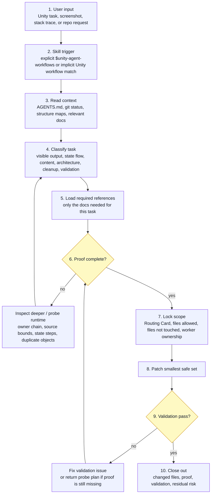
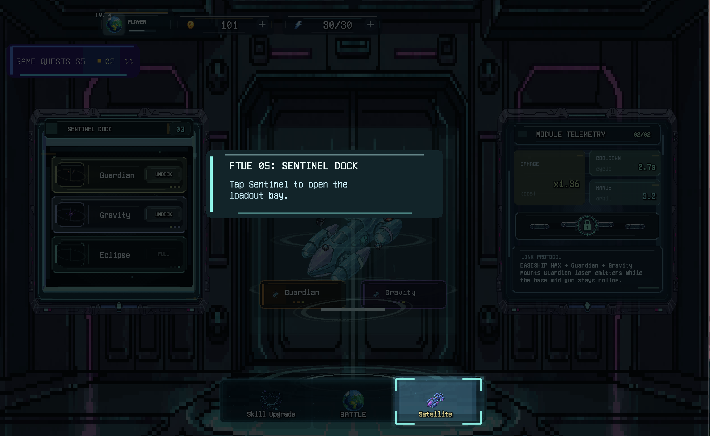
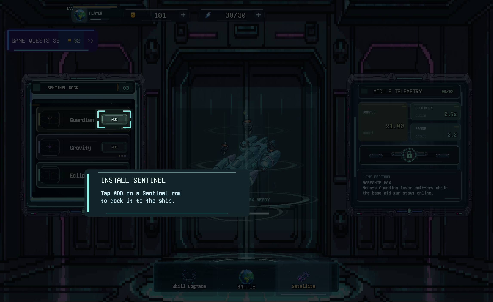
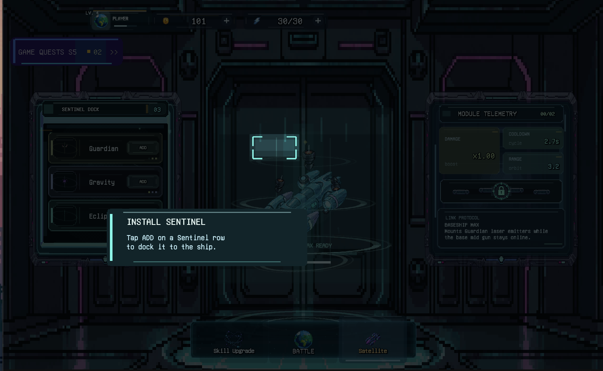

# Unity Game Agent Workflows

[](https://github.com/AUN-PN/unity-agent-workflows/actions/workflows/publish.yml)
[](https://www.npmjs.com/package/unity-agent-workflows)
[](#ติดตั้งเป็น-codex-plugin)

[English](README.md)

Codex plugin, Codex skill และ `npx` installer สำหรับงาน AI-assisted Unity 2D game

ใช้เมื่อ agent ต้องแตะไฟล์ Unity จริง แต่ต้องพิสูจน์ก่อนว่า path ไหนควบคุมสิ่งที่ผู้เล่นเห็นจริง: local rules, project structure, scene/prefab references, runtime owner, mutation path และ validation

| Surface                   | Name                    |
| ------------------------- | ----------------------- |
| npm package               | `unity-agent-workflows` |
| Codex plugin display name | `Unity Workflows`       |
| Skill name                | `unity-agent-workflows` |
| Skill title               | `Unity Agent Workflows` |

กฎหลัก:

```text
No proof, no edit.
```

## ทำไมต้องใช้

Unity agents มักพลาดแบบเดิม: แก้ script ใกล้มือ, เชื่อ scene YAML ที่โดน override ตอน Play Mode, จับ object ชื่อซ้ำผิดตัว, เพิ่ม logic เข้า controller ใหญ่ขึ้นเรื่อยๆ หรือบอกว่า validate แล้วทั้งที่ตรวจแค่ syntax

plugin นี้บังคับ workflow ที่เข้มขึ้นสำหรับ Unity 2D:

- อ่าน project-local instructions ก่อนแตะไฟล์
- รักษา unrelated dirty work
- derive folders, namespaces, assemblies, scenes, prefabs และ content paths จาก repo จริง
- prove runtime-visible owner chain ก่อนแก้ UI, HUD, scene, prefab หรือ gameplay
- route C# responsibility ใหม่ไปหา owner เดิมของโปรเจ็ค แทน broad folders
- ผูกงาน UI/safe-area/TMP/coordinate-space กับ runtime hierarchy จริง
- โหลด deep reference files เฉพาะเมื่อ current task ต้องใช้
- ขออนุมัติก่อน spawn sub-agent ยกเว้น user ขอใช้ใน turn เดียวกันแล้ว
- validate ด้วย check ที่เล็กแต่มีประโยชน์ และรายงาน residual risk ตรงๆ
- ต้องมี reference proof ก่อน cleanup/deletion

`runtime-owner proof` เป็น workflow heuristic ของโปรเจ็คนี้ ไม่ใช่ Unity API term โดยอิงจาก GameObject/Component model, serialized fields, prefab overrides และ runtime instantiation behavior ของ Unity

## ขั้นตอนการทำงาน

plugin เริ่มจาก input ของผู้ใช้, route งาน, แล้ววน proof จนกว่าจะ patch ได้ปลอดภัยหรือปิดงานได้


```mermaid
flowchart TD
    input["1. User input<br/>Unity task, screenshot, stack trace, or repo request"]
    invoke["2. Skill trigger<br/>explicit $unity-agent-workflows or implicit Unity workflow match"]
    context["3. Read context<br/>AGENTS.md, git status, structure maps, relevant docs"]
    classify["4. Classify task<br/>visible output, state flow, content, architecture, cleanup, validation"]
    refs["5. Load required references<br/>only the docs needed for this task"]
    prove{"6. Proof complete?"}
    inspect["Inspect deeper / probe runtime<br/>owner chain, source bounds, state steps, duplicate objects"]
    scope["7. Lock scope<br/>Routing Card, files allowed, files not touched, worker ownership"]
    patch["8. Patch smallest safe set"]
    validate{"9. Validation pass?"}
    fixloop["Fix validation issue<br/>or return probe plan if proof is still missing"]
    close["10. Close out<br/>changed files, proof, validation, residual risk"]

    input --> invoke --> context --> classify --> refs --> prove
    prove -- "no" --> inspect --> classify
    prove -- "yes" --> scope --> patch --> validate
    validate -- "no" --> fixloop --> prove
    validate -- "yes" --> close

    classDef step fill:#eef2ff,stroke:#7c3aed,color:#111827;
    classDef decision fill:#fef9c3,stroke:#ca8a04,color:#111827;
    class input,invoke,context,classify,refs,inspect,scope,patch,fixloop,close step;
    class prove,validate decision;
```

รายละเอียดแต่ละ step:

1. **User input**: รับ Unity task, screenshot, stack trace, feature request, cleanup request หรือ validation request
2. **Skill trigger**: เรียก skill จาก `$unity-agent-workflows` หรือ implicit Unity 2D repo task ที่ต้อง edit, validation, routing, runtime proof, state proof, asmdef/module safety, cleanup หรือ multi-agent coordination
3. **Read context**: อ่าน `AGENTS.md` ถ้ามี, `git status --short`, `UNITY_STRUCTURE.md` เดิมพร้อม focused map ที่ตรงงาน และ docs ที่เกี่ยวข้องเท่านั้น
4. **Classify task**: แยกงานเป็น visible output, state flow, content, architecture, cleanup หรือ validation
5. **Load references**: `SKILL.md` เลือก reference files ที่ต้องใช้ ไม่โหลดทุก rule. `unity-validation.md` และ `workflow-recipes.md` defer จนกว่างานต้องใช้ validation/recipe context
6. **Proof loop**: ถ้า owner chain, overlay/dim source-bound proof, runtime numeric proof หรือ guided state-flow proof ยังไม่ครบ ให้วนกลับไป inspect/probe runtime data
7. **Lock scope**: main agent ระบุ `Files allowed to touch`, `Files explicitly not touched` และ multi-agent ownership ก่อน worker patch. ห้าม spawn sub-agent จนกว่า user อนุมัติ ยกเว้น user ขอใช้ sub-agent ใน turn เดียวกันแล้ว
8. **Patch**: แก้เฉพาะ smallest safe file set หลัง proof ครบ
9. **Validation loop**: validation fail ให้วนกลับไป proof/patch; ถ้ายังขาด runtime proof ให้คืน probe plan แทนการเดา
10. **Close out**: สรุป changed files, proof, validation และ residual risk

## ติดตั้งเป็น Codex Plugin

ใน Codex เปิด Plugins, เลือก Add marketplace แล้วใส่:

```text
Source:
https://github.com/AUN-PN/unity-agent-workflows.git

Git ref:
main

Sparse paths:
```

ปล่อย `Sparse paths` ว่างไว้

Codex marketplace metadata อยู่ที่:

```text
.agents/plugins/marketplace.json
.codex-plugin/plugin.json
plugins/unity-agent-workflows/.codex-plugin/plugin.json
plugins/unity-agent-workflows/skills/unity-agent-workflows/SKILL.md
```

หลัง add marketplace แล้ว install หรือ enable `Unity Workflows` จาก Codex Plugins list

## ติดตั้งเป็น Local Skill

ติดตั้ง skill payload ด้วย `npx`:

```bash
npx unity-agent-workflows
```

ติดตั้งทั้ง Codex และ Claude-style skill folders:

```bash
npx unity-agent-workflows --target both
```

ดู preview โดยไม่เขียนไฟล์:

```bash
npx unity-agent-workflows --dry-run
```

ตำแหน่ง default:

```text
~/.codex/skills/unity-agent-workflows
```

ถ้า target folder มีอยู่แล้ว installer จะ backup ด้วย timestamp ก่อน replace. `npx` installer ติดตั้งเฉพาะ local skill payload; ไม่ได้ add Codex plugin marketplace entry

ตัวเลือก installer:

```text
--target codex|claude|both
--codex
--claude
--all, --both
--dest <path>
--dry-run
--no-backup
--help
--version
-h
-v
```

### Optional skills.sh Discovery

ตรวจ public skill listing:

```bash
npx skills add AUN-PN/unity-agent-workflows --list
```

ติดตั้ง skill ผ่าน `skills` สำหรับ Codex:

```bash
npx skills add AUN-PN/unity-agent-workflows -a codex -y
```

## Quick Start

ใน Unity 2D repo เรียก skill:

```text
$unity-agent-workflows. Teach
```

`Teach` เป็น Codex skill instruction ไม่ใช่ npm CLI command. ใช้เมื่อ onboarding Unity project ใหม่, `UNITY_STRUCTURE*` maps หาย/stale, หรือ user ขอ refresh structure โดยตรง. เมื่อ agent ทำตาม skill จะสร้างหรือ refresh structure index และ focused maps เฉพาะส่วนที่มีประโยชน์:

```text
UNITY_STRUCTURE.md
UNITY_STRUCTURE.ui.md
UNITY_STRUCTURE.runtime.md
UNITY_STRUCTURE.content.md
UNITY_STRUCTURE.assemblies.md
UNITY_STRUCTURE.cleanup.md
```

เพราะ `Teach` เขียนไฟล์ ถ้าต้องการวิเคราะห์ก่อนให้ขอ read-only pass:

```text
Use $unity-agent-workflows.
Do not edit yet. Inspect the project structure and report the proposed UNITY_STRUCTURE map plan.
```

งานถัดไปควรอ่านแค่ `UNITY_STRUCTURE.md` บวก focused map ที่ตรงกับงาน และไม่ควร run `Teach` ซ้ำ เว้นแต่ map ที่จำเป็นหายหรือ stale

| งาน                                                                  | อ่าน                                                  |
| -------------------------------------------------------------------- | ----------------------------------------------------- |
| UI, HUD, menu, safe area, TMP, visible target                        | `UNITY_STRUCTURE.md`, `UNITY_STRUCTURE.ui.md`         |
| Runtime behavior, scene objects, interactions, abilities, objectives | `UNITY_STRUCTURE.md`, `UNITY_STRUCTURE.runtime.md`    |
| Balance, localization, ScriptableObjects, config                     | `UNITY_STRUCTURE.md`, `UNITY_STRUCTURE.content.md`    |
| New files, refactor, asmdef, namespace, dependency                   | `UNITY_STRUCTURE.md`, `UNITY_STRUCTURE.assemblies.md` |
| Deletion, cleanup, generated files, Resources/addressables           | `UNITY_STRUCTURE.md`, `UNITY_STRUCTURE.cleanup.md`    |

### เคสตัวอย่าง: FTUE Sentinel Install Focus

บั๊กคือ FTUE Stage 5 Sentinel install focus เพี้ยนซ้ำ: agent แบบไม่ใช้ plugin ทำให้ข้อความสอนติดตั้ง Sentinel ขึ้นได้ แต่ focus ring ไปอยู่แถว ship ไม่ใช่ปุ่ม `ADD` จริง. รอบที่ใช้ `Unity Workflows` บังคับ main-agent scope lock, sub-agent read-only, runtime numeric proof และ checker criteria ก่อน patch

**ก่อนใช้ plugin: focus ยังอยู่ที่แท็บนำทางล่าง Satellite/Sentinel**



**แก้โดยใช้ `Unity Workflows`: focus ไปอยู่ตำแหน่งปุ่ม Sentinel `ADD` จริง**



**รอบที่ไม่ใช้ plugin rules: ข้อความสอนติดตั้ง Sentinel ขึ้น แต่ focus ไปอยู่แถวตำแหน่งยาน ไม่ใช่ `ADD`**



สิ่งที่ plugin เปลี่ยน:

- มองเป็น repeated visible-output failure
- ขออนุมัติก่อน spawn sub-agent ยกเว้น user ขอใช้ใน turn เดียวกันแล้ว
- ให้ sub-agent เป็น read-only จนกว่า main agent จะ lock scope
- ต้องมี runtime numeric proof ก่อน patch focus/position ซ้ำ
- checker ต้องเทียบว่า final focus อยู่ที่ปุ่ม `ADD` จริง ไม่ใช่แถวยาน

ตัวอย่างคำสั่งเรียกใช้:

```text
Use $unity-agent-workflows.
Fix the FTUE Stage 5 Sentinel ADD focus mismatch.
Main: lock scope, patch only after proof.
Sub-agent A: read-only state flow proof.
Sub-agent B: read-only ADD focus bounds proof.
Checker: verify ADD focus, state steps, and PASS/FAIL criteria.
Do not include private paths or session IDs.
```

## Workflow

skill route งานตามลำดับนี้:

```text
1. Read local rules
2. Check repo state
3. Derive live project structure
4. Classify the task
5. Prove owner or route
6. Name the file boundary
7. Patch the smallest safe file set
8. Run useful validation
9. Close out with proof, validation, and residual risk
```

สำหรับ visible Unity behavior ต้องพิสูจน์ chain นี้:

```text
visible object -> scene/prefab/reference -> script/component -> mutating method -> serialized/runtime override
```

ถ้า chain ยังไม่ครบ agent ควร inspect ต่อ หรือถามคำถามเดียวที่ชัดก่อนแก้

## ครอบคลุมอะไร

| Area                      | สิ่งที่ skill บังคับ                                                                                      |
| ------------------------- | --------------------------------------------------------------------------------------------------------- |
| Runtime-visible bugs      | prove object, owner, mutator และ override path                                                            |
| UI/HUD                    | inspect hierarchy, anchors, safe area, `CanvasScaler`, TMP และ runtime builders                           |
| Visible targets           | resolve runtime bounds แทนการเดา hardcoded coordinates                                                    |
| Repeated visible mismatch | บังคับ runtime numeric proof ก่อน patch coordinate, focus, layout, marker หรือ fallback ซ้ำ               |
| Overlay/dim source bounds | reject overlay, mask, blocker หรือ spotlight surfaces เป็น source bounds ยกเว้น explicit marker prove target |
| Coordinate conversion     | ระบุ world, local, screen, viewport, canvas, camera และ safe-area space ชัด                               |
| Guided state flows        | แยก shown/clicked/opened/selected/equipped/claimed/completed/persisted ก่อน mark completion               |
| Multi-agent work          | ขออนุมัติก่อน spawn แล้ว lock Routing Card, file ownership, runtime proof และ checker gates ก่อน patch   |
| C# routing                | derive folders, namespaces, `.asmdef`, dependency direction และ owner modules                             |
| Content changes           | ใช้ data/config surface เดิมก่อน ถ้าโปรเจ็คมี                                                             |
| Validation                | ใช้ check ที่เล็กแต่มีประโยชน์ และรายงาน exact command output                                             |
| Cleanup                   | prove unused status ผ่าน code refs, YAML/GUID refs, Resources/addressables paths และ runtime reachability |

## Reference Files

[SKILL.md](SKILL.md) ตั้งใจให้สั้น ส่วน workflow ลึกอยู่ใน `references/` และโหลดเฉพาะเมื่องานต้องใช้ ตารางนี้เป็น catalog ไม่ใช่ preload list; agent ต้องตาม `SKILL.md` Required References และ `Read` / `Load Extra Detail` ของแต่ละ reference

| File                                                                                   | ใช้ทำอะไร                                                                    |
| -------------------------------------------------------------------------------------- | ---------------------------------------------------------------------------- |
| [references/ai-workflows.md](references/ai-workflows.md)                               | universal workflow, Routing Card, closeout shape                             |
| [references/project-structure-discovery.md](references/project-structure-discovery.md) | live Unity structure discovery และ `UNITY_STRUCTURE.md` maps                 |
| [references/runtime-owner-proof.md](references/runtime-owner-proof.md)                 | core runtime-visible owner chain และ lazy proof router                       |
| [references/visible-object-identity.md](references/visible-object-identity.md)         | competing visible owners และ anti-anchoring checks                           |
| [references/multi-surface-visible.md](references/multi-surface-visible.md)             | menu/gameplay/preview/runtime surface proof                                  |
| [references/asset-source-lock.md](references/asset-source-lock.md)                     | asset variants, source IDs และ fallback locks                                |
| [references/screenshot-text-owner.md](references/screenshot-text-owner.md)             | visible text, TMP และ localization owner proof                               |
| [references/shared-caller-blast-radius.md](references/shared-caller-blast-radius.md)   | shared helper/factory caller blast-radius proof                              |
| [references/runtime-visible-output.md](references/runtime-visible-output.md)           | output hard stops และ hardcoded layout guard                                 |
| [references/runtime-numeric-proof.md](references/runtime-numeric-proof.md)             | repeated visible mismatch numeric proof                                      |
| [references/serialized-persistence.md](references/serialized-persistence.md)           | scene/prefab serialized persistence proof                                    |
| [references/runtime-visible-targets.md](references/runtime-visible-targets.md)         | focus, highlight, click target, marker และ fallback rules                    |
| [references/target-bounds-catalog.md](references/target-bounds-catalog.md)             | UI, 2D world, VFX, safe-area และ TMP bounds choices                          |
| [references/coordinate-space-conversion.md](references/coordinate-space-conversion.md) | world/local/screen/viewport/canvas/camera/safe-area/RenderTexture conversion |
| [references/modular-architecture.md](references/modular-architecture.md)               | project-derived module boundaries, asmdef safety, hub gates                  |
| [references/unity-validation.md](references/unity-validation.md)                       | validation ladder, Unity/Bee/Roslyn notes, MCP checks                        |
| [references/ui-and-visual-assets.md](references/ui-and-visual-assets.md)               | UI layout, mobile readability, safe area, localization, visual asset gates   |
| [references/content-and-systems.md](references/content-and-systems.md)                 | data-first content และ runtime system readiness                              |
| [references/cleanup-and-git.md](references/cleanup-and-git.md)                         | deletion proof, generated files, commit/push hygiene                         |
| [references/session-mining.md](references/session-mining.md)                           | แปลง lesson จาก agent session เก่าเป็น durable rules                         |
| [references/workflow-recipes.md](references/workflow-recipes.md)                       | optional recipes สำหรับ work patterns ที่พบบ่อย                              |

## ตรวจ Package นี้

สำหรับ repo นี้:

```bash
npm run sync:mcpmarket
npm run validate
npm run pack:dry-run
```

`npm run sync:mcpmarket` mirror `SKILL.md`, `references/` และ `agents/` ไปที่:

```text
.claude/skills/unity-agent-workflows/
skills/unity-agent-workflows/
plugins/unity-agent-workflows/skills/unity-agent-workflows/
```

`npm run validate` ตรวจ package metadata, plugin manifests, mirrored skill payloads, README workflow coverage, reference links, JavaScript syntax, runtime numeric proof triggers, overlay/dim source-bound gates, guided state-flow gates และ multi-agent scope triggers

สำหรับ Unity projects ที่ใช้ skill นี้ Unity Editor, Play Mode, Game view, device tests, batchmode builds และ project logs ยังเป็น validation path หลัก. Bee `.rsp` หรือ direct Unity-bundled Roslyn checks เป็น local compile smoke test แบบ best-effort และอาจ stale หลัง Unity regenerate project artifacts

## กฎความแม่นยำทางฟิสิกส์และคณิตศาสตร์ระดับสากล (Mathematical & Physics Invariants)

การเดาตัวเลขแบบ heuristic ทำให้ AI agent พลาดในการเล็งเป้าและจัดตำแหน่ง UI ปลั๊กอินนี้จึงบรรจุสูตรคำนวณทางคณิตศาสตร์และแบบจำลองฟิสิกส์แบบ Closed-form อิงตามมาตรฐานสากลระดับโลก (ISO/IEC 25010, IEEE 29119, IEEE 754, Pascal VOC/COCO, ACM SIGGRAPH, AIAA):

1. **Projective Geometry & Near-Clip Singularity ($w \le 0$)**:
   - ปัญหา: วัตถุที่อยู่หลังกล้อง ($z_{\text{view}} \le 0$) จะทำให้พิกัดกลับหัว $180^\circ$ เมื่อใช้ `WorldToScreenPoint` แบบธรรมดา
   - วิธีแก้: ตรวจจับ $z_{\text{view}} \le 0$ แล้วกลับทิศทางเรย์และใช้ Screen-Edge Ray-Box Clamping คำนวณขอบจอที่ถูกต้อง
2. **Optical Axis Singularity Degeneracy Guard**:
   - ปัญหา: เมื่อเป้าหมายอยู่ตรงแนวแกนกลางของกล้องด้านหลังพอดี ($x_v = 0, y_v = 0, z_v \le 0$) ขนาดเวกเตอร์จะเป็นศูนย์ ก่อให้เกิดข้อผิดพลาด `NaN` จากการหารด้วย 0
   - วิธีแก้: วางระบบ Degeneracy Guard กำหนดเวกเตอร์ตั้งต้นเป็นเวกเตอร์ชี้ขึ้นด้านบน $\mathbf{d} = (0, 1)^T$ และหนีบขอบจอด้านบนโดยไม่เกิด `NaN`
3. **Frustum Near-Plane 3D Bounding Box Parametric Clipping**:
   - ปัญหา: เมื่อตัดกรอบ 3D Bounding Box ของวัตถุที่มีมุมบางส่วนอยู่หลัง Near-clip plane การฉายมุมทั้งหมดไปยังหน้าจอจะเกิดพิกัดติดลบ ทำให้กรอบ UI ขยายกินทั้งหน้าจอ
   - วิธีแก้: ตัดส่วนขอบ 3D ตามแนวระนาบ Near-plane แบบ Parametric ($t_{\text{clip}} = \frac{z_{\text{near}} - A_z}{B_z - A_z}$) ก่อนฉายลง 2D (Blinn & Newell, Sutherland-Hodgman)
4. **CanvasScaler Logarithmic Match Formula**:
   - ใช้สูตร Exponential/Logarithmic Scale Factor: $\text{scaleFactor} = (W_{\text{actual}} / W_{\text{ref}})^{1-m} \cdot (H_{\text{actual}} / H_{\text{ref}})^m$
   - ป้องกัน Layout เคลื่อน 5%–15% บนจอมือถือและจอ Ultrawide เมื่อเทียบกับการประมาณแบบเชิงเส้น
5. **RectTransform Anchor Span Invariants**:
   - เมื่อยืด Anchor ($\text{anchorMin} \neq \text{anchorMax}$) ต้องใช้สูตร $\text{sizeDelta} = \text{targetSize} - \text{parentSpan}$ เพื่อป้องกัน UI ขยายใหญ่จนล้นจอ
6. **Kinematic Predictive Lead Interception (สมการกำลังสองอันดับสอง)**:
   - แก้สมการ $(|\mathbf{v}_t|^2 - v_p^2) t^2 + 2(\mathbf{r} \cdot \mathbf{v}_t) t + |\mathbf{r}|^2 = 0$ เพื่อหาเวลาตกกระทบ $t^*$ และเวกเตอร์เล็งเป้าของป้อมปืน/กระสุนดักหน้าเป้าหมายที่กำลังเคลื่อนที่ได้อย่างแม่นยำ 100%
7. **Intercept Degeneracy Fallback & Closest Point of Approach (CPA)**:
   - กรณีเป้าหมายหนีเร็วกว่าความเร็วโปรเจกไทล์ ($\Delta < 0$) คำนวณเวลาเข้าใกล้สุด $t_{\text{cpa}} = \max(0, -\frac{\mathbf{r} \cdot \mathbf{v}_{\text{rel}}}{\|\mathbf{v}_{\text{rel}}\|^2})$ เพื่อยิงไปยังจุดเฉียดใกล้สุด
8. **True Proportional Navigation (TPN Guidance Law)**:
   - คำนวณเวกเตอร์ความเร่งนำวิถี $\mathbf{a}_{\text{cmd}} = N \cdot V_c \cdot \boldsymbol{\omega}_{\text{LOS}}$ ($N \in [3, 5]$) สำหรับเป้าหมายที่มีความเร่งหรือเปลี่ยนทิศทาง (Zarchan, AIAA)
9. **Ballistic Trajectories Under Gravity**:
   - สูตรคำนวณมุมยิงวิถีโค้ง $\tan \theta = \frac{v_0^2 \pm \sqrt{v_0^4 - g(g x^2 + 2 y v_0^2)}}{g x}$ ทั้งวิถีราบและวิถีโด่ง
10. **Ballistic Trajectories with Aerodynamic Linear Drag (Unity Rigidbody Damping)**:
    - วิถีโค้งกระสุนที่มีแรงต้านอากาศ $\frac{d\mathbf{v}}{dt} = \mathbf{g} - k\mathbf{v}$ พร้อมเช็กขอบเขตระยะยิงสูงสุดในแนวราบ $x_{\max} = \frac{v_{0x}}{k}$ ป้องกันปัญหายิงไม่ถึงเป้า
11. **Continuous Collision Detection (CCD) & Tunneling Bound**:
    - เกณฑ์การทะลุผ่านของกระสุน $\|\mathbf{v}\| \cdot \Delta t > D_{\min}$ และการตรวจจับด้วย Swept Raycast/CircleCast
12. **Quaternion Antipodal Shortest-Path Slerp (Anti-Flip Guarantee)**:
    - ตรวจสอบ $\mathbf{q}_1 \cdot \mathbf{q}_2 < 0 \implies \mathbf{q}_2 \gets -\mathbf{q}_2$ ก่อนหมุน เพื่อป้องกันอาการกระตุกหมุนอ้อม $360^\circ$ (Shoemake, SIGGRAPH 1985)
13. **Quaternion Small-Angle Nlerp Stability Threshold**:
    - สลับจากการใช้ Slerp ไปเป็น Normalized Lerp (Nlerp) เมื่อมุมหมุนแคบมาก ($\cos\Omega > 0.9995$) เพื่อหลีกเลี่ยงการหารด้วยศูนย์
14. **Symplectic Euler Energy Conservation vs Explicit Euler Divergence**:
    - ใช้ Symplectic Euler ($\mathbf{v}_{t+\Delta t} = \mathbf{v}_t + \mathbf{a}_t\Delta t, \mathbf{x}_{t+\Delta t} = \mathbf{x}_t + \mathbf{v}_{t+\Delta t}\Delta t$) ซึ่งอนุรักษ์พลังงานในระบบฟิสิกส์ PhysX ของ Unity แทน Explicit Euler ที่ทำให้แรงสั่นและวงโคจรระเบิด
15. **Quantitative Spatial Verification (Intersection over Union / IoU)**:
    - ประเมินความแม่นยำของ UI Overlay และ Focus Ring ตามมาตรฐานสากล (Pascal VOC / COCO / ISO/IEC 25010): ต้องได้ $\text{IoU} \ge 0.95$ และ Center Offset $\le 1.0\text{ px}$
16. **Unity 2D Orthographic Camera Viewport & World Projection Bounds**:
    - การแปลงพิกัดมุมมองกล้อง 2D แบบ Orthographic เส้นขนาน ($w = 1$) โดยมีครึ่งความสูง $S = \text{orthographicSize}$ และครึ่งความกว้าง $S \times \text{aspect}$ คำนวณพิกัด Screen สู่ World ได้อย่างแม่นยำปราศจากความคลาดเคลื่อนจาก Perspective
17. **Camera.main.ScreenToWorldPoint 2D z-Distance Plane Invariant**:
    - กฎความแปรเปลี่ยนระนาบ 2D: $\text{screenPoint.z} = z_{\text{target\_plane}} - z_{\text{camera}}$ แก้ปัญหาคลาสสิกที่ใส่ $z = 0$ แล้วพิกัดโลกหลุดไปอยู่ที่ระนาบกล้อง $z = -10$ ทำให้ Raycast 2D และ Trigger วืดไม่โดนวัตถุบนระนาบ $z = 0$
18. **2D Pixel-Perfect PPU Snapping & Sub-Pixel Shimmering Elimination**:
    - การสแนปกริด Texel: $x_{\text{snap}} = \text{round}(x \times \text{PPU}) / \text{PPU}$ ขจัดอาการภาพกระตุก สั่น หรือขอบ Sprite ฉีกขาดในเกม Pixel Art จากเศษตำแหน่งทศนิยม Sub-pixel
19. **Box2D & Rigidbody2D Linear & Angular Drag Damping Dynamics**:
    - การสูญเสียความเร็วเชิงเส้นและเชิงมุมตามกลไก Discrete Damping ของ Box2D ภายใต้ Symplectic Euler integration: $v_{t+\Delta t} = v_t \times \max(0, 1 - \Delta t \cdot d_{\text{linear}})$ พร้อมคำนวณระยะหยุดจำกัด $S_{\text{stop}} = \frac{v_0 (1 - \Delta t \cdot d_{\text{linear}})}{d_{\text{linear}}}$ และตรวจจับกำแพงระยะยิงที่ไม่สามารถไปถึงได้
20. **2D Kinematic Predictive Lead Intercept in XY Plane**:
    - แก้สมการพหุนามกำลังสองสำหรับเล็งดักเป้าหมายเคลื่อนที่ในเกมมุมมอง 2D Top-Down / Space Shooter พร้อม Linear Degeneracy Guard ($A \approx 0$ เมื่อความเร็วกระสุนเท่ากับความเร็วเป้าหมาย) โดยคำนวณเวลาตกกระทบ $t^*$ และมุมยิงได้แม่นยำ
21. **2D Continuous Collision Detection (CCD) & Raycast2D Tunneling Bound**:
    - ป้องกันปัญหากระสุนทะลุกำแพงบาง (Bullet-Through-Paper) เมื่อ $\|\mathbf{v}\|\Delta t > T_{\text{col}}$ ด้วยการคำนวณ Swept Raycast พารามิเตอร์ $t_{\text{hit}} \le \Delta t$
22. **2D Platformer Parabolic Jump Kinematic Apex and Landing Timing**:
    - คำนวณค่าแรงโน้มถ่วง $g = \frac{2h}{t_{\text{apex}}^2}$ และความเร็วต้นกระโดด $v_{y0} = \frac{2h}{t_{\text{apex}}}$ แบบ Closed-Form จากความสูงที่ต้องการ $h$ และเวลาสู่จุดสูงสุด $t_{\text{apex}}$ การันตีการควบคุมกระโดดในเกม Platformer ที่แม่นยำ ไม่ลอย และไม่เดาสุ่ม
23. **2D Steering & True Proportional Navigation (TPN) in XY Plane**:
    - คำนวณเวกเตอร์ความเร่งตั้งฉากกับแนวสายตา $\mathbf{a}_{\text{cmd}} = N \cdot V_c \cdot \dot{\lambda} \cdot (-\sin\lambda, \cos\lambda)^T$ พร้อมรักษาสัญญาณเครื่องหมาย Signed $\dot{\lambda}$ เพื่อให้แรงเลี้ยวต้านการหมุนทั้งทิศทวนเข็มและตามเข็มนาฬิกาอย่างเสถียร
24. **2D Tilemap Grid-to-World Center Pivot Offset Invariant**:
    - การแปลงพิกัด World-to-Cell ด้วยฟังก์ชัน Floor และบวกค่าชดเชยจุดกึ่งกลาง $+0.5$ Half-Tile Pivot ป้องกันปัญหาพิกัดเคลื่อน 1 ช่อง และการติดขอบ Collider ในระบบค้นหาเส้นทาง A* และ Tilemap
25. **2D Separating Axis Theorem (SAT) Minimum Translation Vector (MTV)**:
    - คำนวณแกนที่มีการซ้อนทับน้อยที่สุด $\hat{\mathbf{n}}_{\text{mtv}}$ และความลึก $\delta_{\min}$ บนทุกแกนปกติสำหรับ 2D OBB / Polygon ที่หมุนเอียง เพื่อดันวัตถุหลุดจากการชนด้วยทิศทาง MTV ที่ถูกต้องและไม่สะดุดขอบรอยต่อ
26. **Unity 2D RectTransform in Canvas: Screen Space - Overlay vs World Space PPU Scale Invariant**:
    - บังคับใช้ `camera = null` ใน `ScreenPointToLocalPointInRectangle` สำหรับ Screen Space - Overlay Canvas เพื่อป้องกันข้อผิดพลาดการแปลง Projection และบังคับใช้ $\text{localScale} = (1/\text{PPU}, 1/\text{PPU}, 1)$ สำหรับ World Space Canvas เพื่อป้องกัน UI ขยายขนาดผิดพลาด 100 เท่า (Layout Blowout) บังตัวละครและกล้อง 2D

รันการทดสอบ Benchmark ทางฟิสิกส์และคณิตศาสตร์:
```bash
npm run benchmark:physics
```


## Repository Layout

```text
unity-agent-workflows/
├── .agents/plugins/marketplace.json
├── .codex-plugin/plugin.json
├── .claude/skills/unity-agent-workflows/
├── plugins/unity-agent-workflows/
├── skills/unity-agent-workflows/
├── SKILL.md
├── README.md
├── README.th.md
├── package.json
├── agents/openai.yaml
├── assets/unity-workflows.png
├── bin/unity-agent-workflows.js
├── evals/skill-trigger-cases.json
├── references/
└── scripts/
```

## ข้อจำกัด

- สร้างสำหรับ Unity 2D game projects
- ไม่แทน Unity Play Mode, device testing, build validation, code review หรือ project-local `AGENTS.md`
- ไม่ assume project structure ตายตัว
- ไม่ทำให้ `runtime-owner proof` เป็น official Unity concept; มันคือ guardrail workflow
- `npx` ไม่ได้ติดตั้ง Codex plugin marketplace entry
- อนุญาต public reuse และ external contribution ภายใต้ MIT License; ดู [LICENSE](LICENSE)

## Support

แจ้ง issue ได้ที่:

```text
https://github.com/AUN-PN/unity-agent-workflows/issues
```

## License

MIT License.
