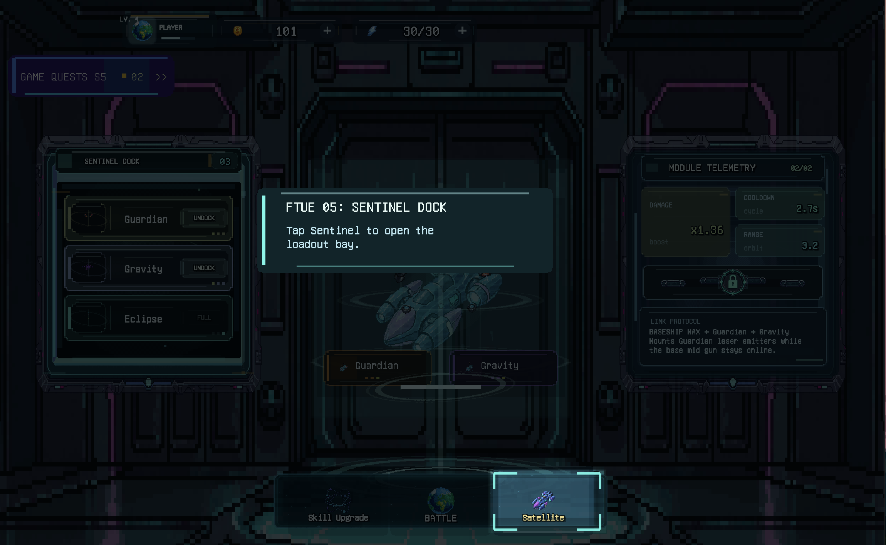
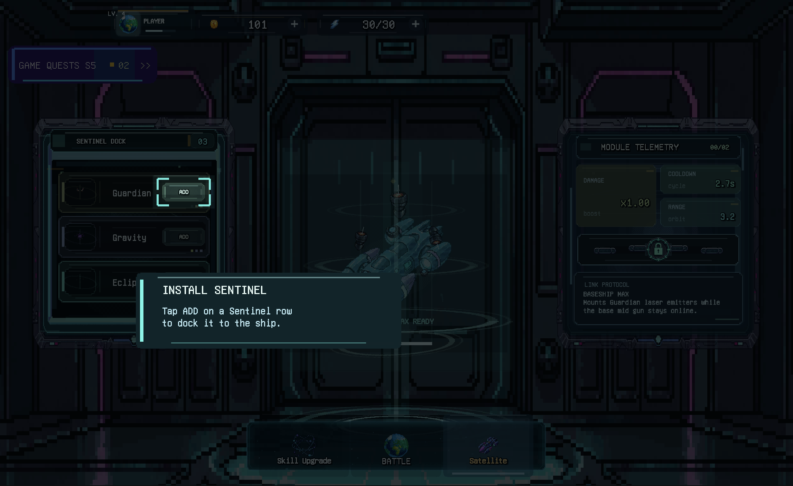

# Unity Workflows

Installable Codex plugin bundle for Unity Agent Workflows.

## Example Case: FTUE Sentinel Install Focus

**Before using the plugin: the focus is still on the bottom Satellite/Sentinel navigation tab.**



**Fix with `Unity Workflows`: the focus moves to the real Sentinel `ADD` button.**



**Fix without plugin rules: the install prompt appears, but the focus lands around the ship position instead of `ADD`.**


Prompt:

```text
Use $unity-agent-workflows.
Fix the FTUE Stage 5 Sentinel ADD focus mismatch. Treat it as a repeated visible-output failure.

Main agent:
- Spawn read-only sub-agents first.
- Gather runtime numeric proof and checker requirements.
- Lock scope before patching.

Sub-agent A:
Read-only only. Follow project-local rules and Unity Workflows. Inspect the Sentinel ADD focus mismatch state/transition timing only. Find the owner chain from Sentinel menu click to install prompt and ADD focus target. Report state steps: shown/clicked/opened/install prompt/equipped/persisted. Do not edit. Do not include private paths or session IDs.

Sub-agent B:
Read-only only. Follow project-local rules and Unity Workflows. Inspect the visible focus coordinate path for the Sentinel install ADD target. Prove target object chain, source bounds selection, destination conversion, and final focus ring values. Do not edit. Report exact runtime numeric proof and checker requirements to compare ADD button and final ring. Do not include private paths or session IDs.

Checker:
Read-only only. Follow project-local rules and Unity Workflows. Determine what must pass after patch: source ADD bounds vs final focus ring bounds, state steps shown/clicked/opened/install/equipped/persisted, and requested Sentinel ADD focus behavior. Do not edit. Return PASS/FAIL criteria. Do not include private paths or session IDs.
```

## Workflow Summary

`Unity Workflows` makes the agent:

- read project-local rules and dirty state first
- classify the task as visible output, state flow, content, architecture, cleanup, or validation
- load only the needed workflow references
- prove the real runtime owner chain before editing visible behavior
- lock main-agent scope and sub-agent ownership before worker patches
- require runtime numeric proof for repeated focus, marker, overlay, or coordinate failures
- validate with the smallest useful check and report residual risk

## Reference Files

The installable skill payload lives in:

```text
skills/unity-agent-workflows/
```

Detailed workflow references live in:

```text
skills/unity-agent-workflows/references/
```

Key references include runtime-owner proof, visible targets, coordinate-space conversion, UI/visual assets, content/systems, validation, cleanup/git, session mining, and workflow recipes.

## Package Validation

From the source repository root:

```bash
npm run validate
npm run pack:dry-run
```

`npm run validate` checks package metadata, plugin manifests, mirrored skill payloads, README workflow coverage, reference links, JavaScript syntax, runtime numeric proof triggers, overlay/dim source-bound gates, guided state-flow gates, and multi-agent scope triggers.

The source repository keeps the skill mirrors synced under:

```text
.claude/skills/unity-agent-workflows/
skills/unity-agent-workflows/
plugins/unity-agent-workflows/skills/unity-agent-workflows/
```

Source repository:

```text
https://github.com/AUN-PN/unity-agent-workflows
```

See the source repository README for installation, usage, validation, support, and contribution details.
